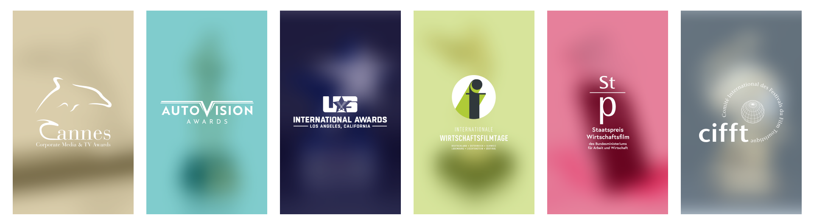
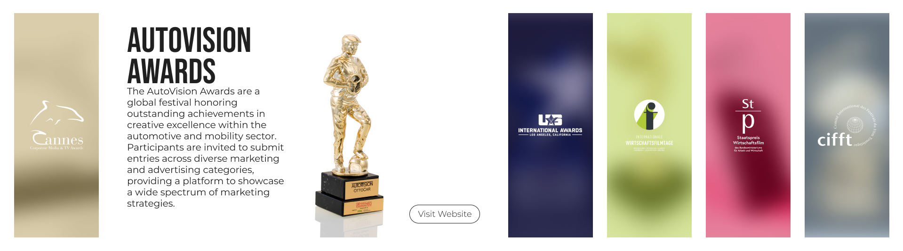

---
# Comandos para Renderizar
## Default - Não é bem o default, mas é o que considero melhor
### pandoc test.md -o example.pdf --from markdown --template eisvogel --listings -V lang=pt --bibliography=fixe.bib --citeproc

# pandoc .\index.md -o index.pdf --from markdown --template eisvogel --listings --number-sections -V lang=pt --bibliography=fixe.bib --citeproc --filter mermaid-filter.cmd

## Number Sections - Coloca uns números em capa heading
### pandoc test.md -o example.pdf --from markdown --template eisvogel --number-sections

## Ver a documentação para outros estilos

title: "Criação e Implementação de um Website Open Source com foco em WordPress"
subtitle: Tecnologias de Comunicação Multimédia - Relatório de Estágio Multimédia
author: Vitor Marques - A041449
date: \today
bibliography: fixe.bib
csl: fixe.csl # Faz sim uma diferença de usar este código, mas o do porto e o default é praticamente igual. depois ver se a renata quer saber

# Capa
### Ativar Capa
titlepage: true
## Cores
### Cor de Fundo da Capa
# titlepage-color: "202020"
### Cor do Texto da Capa
# titlepage-text-color: "ff0000"
### Cor do Risco da Capa
titlepage-rule-color: "0064a1"
## Risco
### Tamanho do Risco da Capa - em pontos
titlepage-rule-height: 10
## Logotipo - Não funciona SVGs
titlepage-logo: logo.png
### Tamanho do Logotipo - default 35mm
logo-width: 75mm
## Imagem de Background
# titlepage-background: 720139.jpg


# Resto das Páginas
## Imagem de Fundo das Páginas Normais
# page-background: 720139.jpg
### Opacidade da Imagem de Fundo - Default é 0.2
# page-background-opacity: 0.5
## caption-justification - Não sei o que faz... mas o default é raggedright

# TOC
### Tem ou não Indice? - Default é Falso
toc: true
### Começar uma nova página, depois do indice
toc-own-page: true
### Tem ou não Tem Indice de Figuras
lof: true
### Tem ou não tem Indice de Tabelas
lot: true
### Como deve ficar as tabelas, para aparecerem
# | Fixe | Fixe | 
# | --- | --- | 
# | 1 | 2 |
# | 3 | 4 |

# : Tabela Exemplo

# Não sei como funciona... https://pandoc.org/MANUAL.html#front-matter
thanks: true


# Código
## Desligar os números que aparecem das linhas do código - default é false
listings-disable-line-numbers: false
## Impedir uma quebra de linha dentro dos códigos - default é false - NÃO TENHO A CERTEZA
listings-no-page-break: false
## Tamanho das letras dentro do código - default \small
code-block-font-size: \small
### Tamanhos Possíveis
#### \tiny
#### \scriptsize
#### \footnotesize
#### \small
#### \normalsize
#### \large
#### \Large
#### \LARGE
#### \huge
#### \Huge


# Header e Footer
## Desligar Header e Footer - Default false
disable-header-and-footer: false

## Header
#### Contéudo do Header
header-left: Relatório de Estágio # Default para o título
# header-center: FIXE epico GAMER # texto no centro do header
header-right: " " # Default para a data

## Footer
#### Contéudo do Footer
footer-left: Vitor Tiago Magalhães Marques  #Default para o Autor
# footer-center: alguma coisa no centro # texto no centro do footer
# footer-right # Default é o page number


# Footnones
## Deixar as footnotes mais bonitas - Default False
footnotes-pretty: false # Em suma, deixa um espaço maior entre cada footnote
## Desligar o link das footnotes para o fim da página - Default false
footnotes-disable-backlinks: false # Alterei ambos e não vi diferença...

# Book
## Exportar como livro - Default false
book: false # Acho que muda o tamanho da folha impressa

# Imagens
## Posição das Imagens - Default h
# float-placement-figure: h # Por algum motivo, buga a imagem de fundo
### Valores que pode ser
#### t - topo da página
#### b - fundo da página
#### p - coloca na próxima página, onde apenas existe figuras e tabelas
#### h - coloca mais ao menos onde está no texto/markdown
#### H - coloca EXATAMENTE onde está no texto/markdown

# Tabelas
## Separar as linhas por cores - Default false
table-use-row-colors: true

#\pagenumbering{alph} % set the numbering style to lowercase letter
#style can be any of these:
#arabic: arabic numerals
#roman: lowercase roman numerals
#Roman: uppercase roman numerals
#alph: lowercase letters
#Alph: uppercase letters

block-headings: true

---

\setcounter{page}{0}

\setcounter{page}{0}

\pagebreak

\setcounter{page}{0}
# Sumário

{width=500px}

\pagebreak

\setcounter{page}{0}

# Agradecimento

{width=500px}

\pagebreak

\setcounter{page}{0}

# Introdução

{width=500px}

\setcounter{page}{0}

## Enquadramento Empresarial

{width=500px}

A Filmservice International, com sede em Viena, Áustria, é a maior organizadora de festivais de filmes corporativos na Europa. Sob a liderança de Alexander V. Kammel, a empresa organiza vários eventos prestigiosos, incluindo os prémios ‘AutoVision Awards’ em Munique a cada dois anos, os ‘Internationale Wirtschaftsfilmtage’ em Viena, os prêmios anuais Cannes Corporate Media & TV Awards em Cannes e os US International Awards em Los Angeles. Além disso, Alexander V. Kammel é o cofundador e diretor do festival Grand Prix CIFFT, que reconhece os melhores filmes de turismo do mundo. Ele também atua como presidente dos Arquivos Austríacos para médias audiovisuais corporativas, educacionais e culturais, e organiza o ‘Staatspreis Wirtschaftsfilm’.

Eu fui inserido, no escritório local da empresa, de maneira a incentivar a cooperação entre todos da empresa. Fui a uma entrevista onde falei das minhas capacidades e habilidades e também expliquei a razão por entrar no estágio com eles. Depois de um dia de preparação do material por ambas as partes, eu comecei a estagiar. Todos na empresa tem acesso à sua própria estação de trabalho e foi o mesmo para mim. Foi-me oferecido um computador e um espaço para montar o meu próprio escritório, ao lado dos demais empregados. Tive a liberdade de fazer a organização da forma que considerava melhor. A minha coordenadora e os demais empregados da empresa, estavam sempre disponíveis para resolver as minhas dúvidas e eu as deles. Isto deve-se ao facto de todos na empresa procurarem o trabalho em conjunto, onde cada um pode se focar naquilo que é melhor e também a ajudar os outros. Isto tem grandes resultados não só no ambiente de trabalho como também para com a eficácia do trabalho.

\pagebreak

# Estado de Arte

## Open Source

### Definição

Software de open source (Open Source) refere-se a software distribuído ao abrigo de licenças que concedem aos utilizadores acesso ao código-fonte, permitindo-lhes estudá-lo, modificá-lo e redistribuí-lo livremente[@androutsellis-theotokis_open_2010]. Este conceito permite a uma comunidade colaborativa de programadores e utilizadores melhorar coletivamente a funcionalidade e a qualidade do software. As licenças de open source variam nos seus requisitos relativamente à distribuição de modificações, com algumas a exigirem que os trabalhos derivados sejam também de open source, enquanto outras permitem modificações proprietárias. O seu aparecimento teve um impacto significativo em vários sectores, incluindo o desenvolvimento de software, a inovação em hardware, o meio académico, a economia em geral e o desenvolvimento de websites[@androutsellis-theotokis_open_2010]. Ao democratizar a tecnologia e a inovação, os modelos de open source oferecem oportunidades valiosas para a investigação, o envolvimento dos estudantes e o desenvolvimento de novos modelos empresariais e de software [@androutsellis-theotokis_open_2010].

A origem do software de open source remonta aos anos 50 e solidificou-se nos anos 70 e 80 com os esforços da cultura hacker, em particular através do projeto GNU iniciado por Richard Stallman [@jin_open_2018]. O conceito de open source gira em torno da ideia de partilhar e modificar livremente o código-fonte do software, em contraste com o software proprietário que restringe o acesso ao código-fonte [@jin_open_2018]. O movimento open source ganhou força com o desenvolvimento de projetos como o Linux, permitindo o trabalho colaborativo de software em comunidades globais. 

Ao longo do tempo, o software de open source evoluiu para uma força dominante em vários sectores, incluindo a computação integrada, os dispositivos móveis e a nuvem, influenciando tanto o panorama tecnológico como as perceções culturais do desenvolvimento de software. 

### Open Source vs. Free Software

{width=500px}

### Benefícios do Open Source

O software de código aberto oferece uma flexibilidade e opções de personalização sem paralelo, permitindo aos utilizadores modificar e adaptar o código às suas necessidades específicas. Isto não só garante que as soluções sejam adaptadas para satisfazer requisitos únicos, como também promove um sentido de propriedade e controlo entre os utilizadores[@prokakis_free_2022]. Além disso, a comunidade de open source desempenha um papel vital na promoção da inovação, com os colaboradores a participarem ativamente na correção de erros, nos pedidos de funcionalidades e nos melhoramentos.

Uma das vantagens mais significativas do software open source é a sua relação custo-eficácia. Como está disponível gratuitamente, os indivíduos ou as organizações podem aceder-lhe sem incorrer em custos substanciais[@gediya_7_2019]. Isto não só reduz os encargos financeiros, como também permite às empresas afetar recursos de forma mais eficiente, conduzindo a um desenvolvimento mais rápido e a uma redução das despesas.

Além disso, o software de fonte aberta aumenta a privacidade e a transparência do utilizador, reduzindo a assimetria de informação entre os criadores e os utilizadores. A natureza colaborativa da comunidade de software open source garante que as soluções são fiáveis, seguras e continuamente melhoradas, o que resulta numa maior qualidade global do software.

Em geral, as vantagens do open source tornam-no uma opção atrativa para indivíduos e organizações que procuram soluções flexíveis, económicas e seguras que satisfaçam as suas necessidades específicas. Por exemplo, seguindo uma perspetiva de editores de vídeo, quando se utiliza um software proprietário como o Adobe Premiere Pro, este é vinculado aos seus termos de serviço. Tem um controlo limitado sobre os seus dados e podemos ser forçados a partilhá-los com empresas terceiras. Isso pode levar a preocupações sobre privacidade e segurança.

Por outro lado, o Shotcut é um software de edição de vídeo de código aberto que dá controlo total sobre os seus ficheiros e dados. É livre de o utilizar sem quaisquer restrições ou limitações. Com o Shotcut, podemos:

- **Manter os nossos vídeos privados:** Uma vez que o Shotcut não recolhe nem partilha dados do utilizador, dá para ter a certeza de que o trabalho criativo permanece confidencial. 
- **Personalizar o software:** Como um projeto de código aberto, o Shotcut é orientado para a comunidade e permite que os utilizadores contribuam com código. Isto significa que existe a possibilidade de adaptar o software às necessidades específicas e ao fluxo de trabalho de cada um. 


### História do Open Source

{width=500px}

> Texto em Extenso

---

A história do software de fonte aberta remonta aos primórdios da computação e ao aparecimento da cultura hacker. Na década de 1970, o conceito de software de código aberto começou a tomar forma, embora ainda não fosse formalmente designado ou amplamente reconhecido. Durante este período, o desenvolvimento de software era frequentemente um processo fechado e proprietário, com as empresas a guardarem o seu código e a restringirem o acesso ao mesmo. [@bretthauer_open_2001]

Uma das figuras centrais no desenvolvimento inicial do software de código aberto foi Richard Stallman, fundador da Free Software Foundation. A defesa de Stallman da liberdade do software e a sua criação do Projeto GNU lançaram as bases do movimento do software de código aberto. Stallman acreditava na importância dos direitos dos utilizadores para aceder, modificar e distribuir software, o que levou ao desenvolvimento da Licença Pública Geral GNU (GPL). [@dibona_open_1999]

O Projeto GNU, iniciado por Stallman nos anos 80, tinha como objetivo criar um sistema operativo livre e de código aberto do tipo Unix. Este projeto marcou um afastamento significativo do modelo de software proprietário prevalecente e enfatizou os princípios de colaboração, desenvolvimento orientado para a comunidade e liberdade de software. A visão de Stallman de um mundo em que os utilizadores tinham a liberdade de controlar a sua experiência de computação teve eco em muitos programadores e entusiastas, lançando as bases para o movimento de código aberto. [@stallman_free_2002]

À medida que o Projeto GNU ganhava força, atraía uma comunidade crescente de programadores que partilhavam o compromisso de Stallman com os princípios do código aberto. Esta comunidade não só contribuiu com código para o projeto como também abraçou o espírito de partilha, colaboração e transparência que definia a cultura de código aberto. O Projeto GNU serviu de catalisador para o desenvolvimento de outras iniciativas de código aberto e inspirou uma nova geração de programadores a abraçar os valores da liberdade do software. [@noauthor_what_nodate]

Em paralelo com os esforços de Stallman, a cultura hacker desempenhou um papel crucial na formação do desenvolvimento inicial do software de código aberto. Os hackers, no sentido positivo do termo, eram programadores qualificados e amadores apaixonados que procuravam fazer avançar a ciência informática através da inovação colaborativa. O espírito dos hackers de partilhar conhecimentos, mexer no código e ultrapassar os limites da tecnologia estava estreitamente ligado aos princípios do software de fonte aberta. [@raymond_cathedral_1999]

---

\pagebreak


> Texto Organizado Por Subcapitulos

---

O software de código aberto tem uma longa história que remonta aos primórdios da computação. No entanto, foi apenas na década de 1970 que o conceito de software de código aberto começou a tomar forma.

#### A Fundação da Free Software Foundation

Richard Stallman, fundador da Free Software Foundation, é uma das figuras centrais no desenvolvimento do software de código aberto. Ele defendeu a liberdade do software e criou o Projeto GNU, que lançou as bases do movimento do software de código aberto. A Licença Pública Geral GNU (GPL) foi criada para garantir que os utilizadores tivessem os direitos de acesso, modificação e distribuição do software. [@dibona_open_1999]

#### O Projeto GNU

O Projeto GNU, iniciado por Stallman nos anos 80, teve como objetivo criar um sistema operativo livre e de código aberto do tipo Unix. O projeto marcou uma mudança significativa no modelo de software proprietário prevalecente e enfatizou os princípios de colaboração, desenvolvimento orientado para a comunidade e liberdade de software. [@stallman_free_2002]


#### A Comunidade de Código Aberto

À medida que o Projeto GNU ganhava força, atraía uma comunidade crescente de programadores que partilhavam o compromisso de Stallman com os princípios do código aberto. Esta comunidade não só contribuiu com código para o projeto como também abraçou o espírito de partilha, colaboração e transparência que define a cultura de código aberto.

#### A Cultura Hacker

A cultura hacker desempenhou um papel crucial na formação do desenvolvimento inicial do software de código aberto. Os hackers, no sentido positivo do termo, eram programadores qualificados e amadores apaixonados que procuravam fazer avançar a ciência informática através da inovação colaborativa. [@noauthor_what_nodate]

#### Consequências

O movimento do software de código aberto inspirou uma nova geração de programadores a abraçar os valores da liberdade do software. Hoje em dia, o software de código aberto é amplamente utilizado e contribui para a inovação e a evolução da tecnologia.

---

\pagebreak


### Evolução da Filosofia Open Source


{width=500px}


A evolução da filosofia do software livre ao longo do tempo reflecte uma mudança significativa na abordagem ao desenvolvimento de software, dando ênfase à colaboração, transparência e envolvimento da comunidade. Esta evolução tem sido moldada pelas expectativas culturais e filosóficas que sustentam os projetos de software livre, bem como pela distinção entre software livre e software de código aberto.

O conceito de software de fonte aberta surgiu como uma resposta ao modelo tradicional de software proprietário, em que o código era mantido fechado e o acesso era restrito. A filosofia do software de fonte aberta defende a partilha do código-fonte, permitindo aos utilizadores ver, modificar e distribuir software livremente. Este espírito de abertura e transparência promove uma cultura de colaboração e inovação no seio da comunidade de desenvolvimento de software.

No centro da filosofia de código aberto está o princípio do desenvolvimento orientado para a comunidade. Os projectos de software livre baseiam-se nos esforços colectivos de um grupo diversificado de programadores, entusiastas e utilizadores que contribuem para a melhoria e evolução do software. Esta abordagem colaborativa não só acelera o ritmo da inovação, como também garante que o software se mantém acessível e adaptável a uma vasta gama de utilizadores.[@fuggetta_open_2003]

Em contraste com o software de fonte aberta, o software livre coloca uma maior ênfase nas liberdades dos utilizadores e em considerações éticas. A Free Software Foundation, fundada por Richard Stallman, defende as quatro liberdades essenciais do software: a liberdade de executar o programa para qualquer fim, a liberdade de estudar como o programa funciona e adaptá-lo às suas necessidades, a liberdade de redistribuir cópias e a liberdade de distribuir cópias das suas versões modificadas a outros.[@noauthor_free_nodate]

Embora o software livre e o software de código aberto partilhem objetivos comuns de promoção da liberdade de software e da colaboração, diferem nos seus fundamentos filosóficos. O software livre dá prioridade aos direitos dos utilizadores e a considerações éticas, enquadrando o software como uma questão de justiça social e de liberdades individuais. Por outro lado, o software de código aberto concentra-se mais nos benefícios práticos do desenvolvimento colaborativo, enfatizando as vantagens de eficiência, fiabilidade e segurança das metodologias de código aberto. [@noauthor_free_nodate]

A evolução da filosofia do software de código aberto tem sido marcada por um reconhecimento crescente da importância da transparência, do envolvimento da comunidade e da inovação partilhada no desenvolvimento de software. Ao adotar os princípios do software livre e de código aberto, tanto os programadores como os utilizadores contribuem para um ecossistema vibrante de criatividade, cooperação e avanço tecnológico.[@noauthor_why_nodate]

### Impacto no Desenvolvimento de Software

{width=500px}

## CMS

### Definição

Plataformas de gestão de conteúdo são uma solução robusta que ajuda, empresas a gerir o seu conteúdo digital em sites sem necessidade de habilidades técnicas avançadas. Elas funciona como uma caixa de ferramentas virtual, facilitando a criação e organização de conteúdo online [@wilson_content_2023].

O sistema de gestão de conteúdo é um local único para armazenar informações e oferece processos automatizados para gestão e criação colaborativa, utilizando fluxos de trabalho incorporados. Isto permite que equipas trabalhem juntas de forma eficaz, com diferentes privilégios e responsabilidades atribuídos a indivíduos com base em funções [@wilson_content_2023].

Por exemplo, autores podem publicar e armazenar o seu trabalho, enquanto editores podem modificá-lo e publicá-lo. Administradores podem realizar todas as tarefas, incluindo conceder permissão a outros membros da organização para atualizar ou rever conteúdo.

Com um sistema de gestão de conteúdo, empresas podem criar e gerir websites e conteúdo em sites com despesas técnicas mínimas, permitindo que criem melhores conteúdos sem precisar agir como gerente de projetos ou tráfego. Além disso, um CMS permite às empresas gerir e distribuir conteúdo sem investir numa equipa de desenvolvimento a tempo inteiro.

O melhor é que não é necessário ter habilidades técnicas avançadas para criar e gerir conteúdo digital, utilizando uma CMS. Isto significa que podemos nos concentrar na criação de conteúdo interessante para o público, deixando o trabalho técnico pesado para o sistema. Com um sistema de gestão de conteúdo, empresas podem se concentrar em melhorar a experiência do utilizador e aumentar a sua visibilidade online, sem precisar se preocupar com as complexidades técnicas.

### Vantagens de Usar um CMS

Na era digital atual, os sistemas de gestão de conteúdos (CMS) tornaram-se uma ferramenta essencial para a gestão e apresentação de conteúdos digitais. Ao fornecer uma plataforma de fácil utilização para criar, editar e armazenar conteúdos, os CMS revolucionaram como partilhamos conhecimentos e colaboramos com os outros[@wilson_content_2023].

#### Facilidade de Criação e Gestão de Conteúdos

Uma das principais vantagens da utilização de um CMS é a sua facilidade de utilização. Com um CMS, podemos criar e gerir conteúdo digital sem precisar de ter grandes conhecimentos técnicos[@wilson_content_2023]. Por exemplo, digamos que é um programador Web a trabalhar num projeto para um museu. Pode utilizar um CMS como o WordPress ou o Drupal para criar exposições online interessantes que mostrem a coleção do museu. Com um CMS, pode carregar facilmente imagens, vídeos e texto, e personalizar a disposição e o design da sua exposição.

#### Escalabilidade e Flexibilidade

Outra vantagem da utilização de um CMS é a sua escalabilidade e flexibilidade[@wilson_content_2023]. Um CMS pode crescer com o seu projeto ou organização, permitindo-lhe adicionar novas características e funcionalidades conforme necessário. Por exemplo, se a exposição do seu museu online se tornar popular e receber inúmeros visitantes, pode facilmente aumentar o seu CMS para lidar com o aumento do tráfego.

#### Segurança e Manutenção Melhoradas

Embora as aplicações CMS como o WordPress, Drupal e Joomla tenham facilitado a criação e gestão de conteúdos digitais por parte das organizações, também apresentam riscos de segurança. Para mitigar estes riscos, é essencial manter o seu CMS atualizado com atualizações e manutenção regulares. Além disso, a implementação de práticas recomendadas, como a utilização de palavras-passe fortes, a atualização de plug-ins e temas e a criação regular de cópias de segurança dos dados, pode ajudar a evitar o acesso não autorizado e as violações de dados.

#### Melhor Colaboração e Fluxo de Trabalho

Um CMS também pode melhorar a colaboração e o fluxo de trabalho numa equipa ou organização. Por exemplo, pode utilizar um CMS para criar identificadores de projetos, armazenar referências entre projetos e itens de projetos e apresentar dados relacionados com projetos numa interface de fácil utilização. Isto pode aumentar a produtividade e a organização na gestão de projetos, facilitando o trabalho eficaz das equipas.

Em conclusão, a utilização de um sistema de gestão de conteúdos oferece inúmeras vantagens, incluindo a facilidade de criação e gestão de conteúdos, escalabilidade e flexibilidade, segurança e manutenção melhoradas e melhor colaboração e fluxo de trabalho. Ao escolher o CMS adequado às suas necessidades e ao implementar as melhores práticas de segurança e manutenção, pode libertar todo o potencial dos conteúdos digitais e melhorar a sua presença em linha.


### Tipos de CMSs

Um Sistema de Gestão de Conteúdo (CMS) é composto por dois componentes essenciais: a área frontal e a área posterior.

A **área frontal**, também conhecida como frontend, é o ponto de interação do utilizador com o site. É aqui que a estrutura e o estilo do website são definidos, utilizando HTML, CSS e JavaScript para apresentar conteúdo rico e personalizado. A área frontal é responsável por fornecer uma experiência visual atraente e fácil de navegar.

Por outro lado, a **área posterior**, também conhecida como backend, é a aplicação que publica novos conteúdos no site. O processo começa quando o utilizador acessa uma interface web fácil de usar para adicionar, criar e publicar conteúdo na área frontal do CMS. Em vez de precisar de habilidades em HTML, CSS e JavaScript, o utilizador pode criar conteúdo num ambiente semelhante ao Microsoft Word.

A área posterior armazena o conteúdo no banco de dados e a pública na área frontal do website. Isso permite que os utilizadores publiquem conteúdo sem precisar entender tecnologias web ou construir a sua aplicação web desde o início.

Juntos, esses dois componentes formam o CMS, oferecendo uma solução escalável e flexível para gerir conteúdo em diferentes plataformas. A combinação da área frontal e da área posterior permite que os utilizadores criem e publiquem conteúdo de forma rápida e eficiente, sem precisar de habilidades técnicas especializadas.


#### CMSs Tradicionais

Um sistema de gestão de conteúdos (CMS) acoplado, ou tradicional, é uma escolha popular para aqueles que querem ter controlo total sobre o design e a funcionalidade do seu site. Este tipo de CMS oferece uma interface de fácil utilização que permite aos administradores gerir facilmente o conteúdo do website, a base de dados e o desempenho geral.

Uma das principais vantagens de um CMS tradicional é a sua capacidade de fornecer um back end totalmente acessível que se liga à base de dados do site e a modifica, permitindo a publicação contínua de conteúdos num front end com estilo [@noauthor_who_nodate]. Isto faz com que seja a escolha ideal para aqueles que querem ter controlo criativo sobre o design e a disposição do seu website.

No entanto, existem alguns inconvenientes na utilização de um CMS acoplado. Por exemplo, estes sistemas requerem frequentemente um alojamento Web dedicado para funcionar, o que pode aumentar o custo global de manutenção do website. Além disso, os administradores também têm de instalar e manter tecnologias específicas para tornar o software funcional, o que pode ser demoroso e exigir conhecimentos técnicos[@noauthor_who_nodate].

Também, a instalação e configuração de um CMS acoplado pode ser um processo complexo que exige que o administrador tenha algum nível de conhecimento técnico. O WordPress é um exemplo popular de um CMS tradicional, oferecendo um pacote completo para os utilizadores instalarem, lançarem um website e publicarem conteúdos. Em geral, embora um CMS tradicional ofereça muitos benefícios, é essencial considerar as potenciais desvantagens antes de decidir se deve ou não utilizar este tipo de sistema.

Em conclusão, um CMS tradicional pode ser uma excelente escolha para aqueles que querem ter controlo total sobre o design e a funcionalidade do seu website. No entanto, os administradores devem estar conscientes dos potenciais inconvenientes e estar dispostos a investir tempo e recursos na manutenção do sistema.

#### Software as a Service CMSs

Um Sistema de Gestão de Conteúdos (CMS) baseado em SaaS oferece uma abordagem simplificada à criação e gestão de websites. Esta solução alojada na nuvem elimina a necessidade de configuração, instalação ou alojamento web pré-configurado, tornando-a uma opção atrativa para as empresas que procuram uma presença online simples[@noauthor_who_nodate].

Ao tirar partido do poder da nuvem[@noauthor_who_nodate], o SaaS CMS fornece uma solução completa que simplifica a criação, a gestão e a distribuição de conteúdos. Com a sua interface intuitiva, os utilizadores de várias origens podem criar rapidamente sites, gerir conteúdos e partilhá-los em canais digitais[@contentful_headless_2023]. Esta flexibilidade é particularmente útil para as empresas que procuram estabelecer uma forte presença online sem incorrer nos custos e complexidades associados às soluções CMS tradicionais.

Uma das principais vantagens do CMS SaaS é a sua escalabilidade. À medida que o seu negócio cresce, pode facilmente atualizar o seu plano para acomodar o aumento do tráfego ou das exigências de conteúdo. Esta escalabilidade também permite uma maior flexibilidade em termos de colaboração entre equipas, uma vez que vários utilizadores podem aceder e contribuir para o website em simultâneo[@noauthor_headless_nodate].

Para além da sua facilidade de utilização e escalabilidade, o CMS SaaS também oferece funcionalidades de segurança robustas para proteger informações sensíveis. Com atualizações e cópias de segurança automáticas, pode ter a certeza de que os seus dados estão seguros e são facilmente recuperáveis em caso de um evento inesperado.

Para ilustrar as vantagens do CMS SaaS, considere uma pequena empresa de comércio eletrónico que pretende criar uma loja online. Ao tirar partido de uma solução baseada em SaaS, pode criar rapidamente um website com aspeto profissional sem necessitar de grandes conhecimentos técnicos. Isto permite-lhes concentrarem-se no que é mais importante - fornecer um excelente serviço ao cliente e construir a sua marca.

Em conclusão, o CMS SaaS representa uma abordagem revolucionária à criação e gestão de sítios Web. A sua facilidade de utilização, escalabilidade e características de segurança robustas tornam-no uma opção atrativa para as empresas que procuram uma presença online simples sem a necessidade de soluções técnicas complexas.

#### Decoupled CMSs

Num sistema de gestão de conteúdos (CMS) decoupled, a camada de apresentação é separada do backend[@noauthor_who_nodate]. Um sistema de entrega atua como intermediário entre o frontend e o backend, acedendo a este último via uma interface de programação de aplicações (API)[^API].

Esta abordagem proporciona uma maior flexibilidade na interação com o conteúdo criado no backend. Por exemplo, considere uma organização que procura utilizar a sua biblioteca de conteúdos para um novo fim, como aplicações móveis[@masini_what_nodate]. Neste cenário, um decoupled CMS é uma solução atrativa porque permite o desenvolvimento de aplicações múltiplas e adaptáveis no frontend, mantendo a consistência no backend.

Um exemplo desta flexibilidade é visto na utilização de APIs para integrar serviços de terceiros com um website ou aplicação. Ao tirar partido das API, os programadores podem incorporar sem problemas conteúdos e funcionalidades existentes nos seus projetos sem comprometer a integridade do material de origem original.

Além disso, as soluções decoupled empregam frequentemente princípios de conceção modular, permitindo a criação de componentes reutilizáveis que podem ser facilmente integrados em várias aplicações. Esta abordagem permite que as organizações se adaptem rapidamente às condições de mercado em mudança ou às necessidades dos clientes, modificando módulos específicos em vez de reconstruir sistemas inteiros.

Também, uma arquitetura dissociada proporciona uma maior escalabilidade e facilidade de manutenção, uma vez que os componentes individuais podem ser atualizados ou substituídos de forma independente sem afetar outras partes do sistema. Isto resulta num processo de desenvolvimento mais eficiente, tempo de inatividade reduzido e melhor desempenho geral do sistema. Ao adotar uma estratégia decoupled CMS, as organizações podem desbloquear novas possibilidades de reutilização de conteúdos, adaptabilidade e inovação, mantendo o controlo sobre os seus ativos digitais.


[^API]: Uma API liga programas ou componentes de computador, oferecendo um serviço a outro software. Trata-se de um documento que descreve como construir ou utilizar esta ligação. Ao contrário das interfaces de utilizador, as APIs ligam computadores ou software entre si. Não se destinam à interação humana direta, mas sim aos programadores que as integram no seu software. Uma API tem frequentemente diferentes partes que atuam como ferramentas ou serviços disponíveis para os programadores[@reddy_api_2011].

#### Headless CMSs

Os Headless CMSs são uma categoria mais recente de CMSs que se concentram apenas na gestão de conteúdos, sem estarem ligados a uma camada de apresentação específica . Contentful é um exemplo de um CMS headless. Neste tipo de configuração, o CMS fornece APIs para recuperar e manipular conteúdos, que podem ser consumidos por qualquer estrutura ou aplicação front-end. Esta abordagem oferece maior flexibilidade e escalabilidade.

Um Headless CMS  oferece às organizações uma abordagem única à gestão de conteúdos. Ao contrário dos sistemas CMS tradicionais, não possui uma interface de front-end e, em vez disso, baseia-se em aplicações personalizadas para aceder e apresentar conteúdos[@contentful_headless_2023].

Uma das principais vantagens de um CMS sem interface é a sua flexibilidade. Ao dissociar o sistema back-end da aplicação front-end, os programadores têm um maior controlo sobre como o seu conteúdo é apresentado. Isto permite um elevado grau de personalização, tornando-o uma opção atrativa para organizações com necessidades de conteúdo complexas ou específicas[@noauthor_headless_nodate].

Por exemplo, uma empresa que pretenda criar uma aplicação móvel e um website com capacidade de resposta pode utilizar um CMS sem interface para armazenar o seu conteúdo de forma centralizada, ao mesmo tempo que fornece diferentes camadas de apresentação para cada aplicação. Esta abordagem também permite que os programadores reutilizem conteúdos em várias plataformas, reduzindo a necessidade de esforços duplicados.

Outra vantagem de um Headless CMS é a sua escalabilidade. À medida que as necessidades de conteúdo de uma organização evoluem, esta pode facilmente adicionar ou modificar aplicações front-end sem afetar o sistema back-end subjacente[@contentful_headless_2023]. Isto faz com que seja uma solução ideal para as empresas que registam um crescimento rápido ou exigências variáveis.

Para além da sua flexibilidade e escalabilidade, um Headless CMS também proporciona um maior controlo da segurança e do acesso. Ao separar o sistema back-end da aplicação front-end, os programadores podem implementar medidas de segurança mais rigorosas para proteger dados sensíveis[@noauthor_headless_nodate]. Isto é particularmente importante para as organizações que lidam com informações confidenciais ou que trabalham com sectores regulamentados. Embora um Headless CMS ofereça muitas vantagens, também requer mais trabalho do que os sistemas CMS tradicionais. Os programadores têm de conceber, criar e ligar aplicações front-end personalizadas, o que pode ser demorado e exigir muitos recursos. No entanto, a flexibilidade e a escalabilidade oferecidas por esta abordagem fazem com que seja um investimento que vale a pena para as organizações que procuram um maior controlo sobre o seu conteúdo. Em conclusão, um Headless CMS é uma solução poderosa para as organizações que necessitam de controlo e flexibilidade totais sobre como o seu conteúdo é acedido e apresentado. Ao fornecer armazenamento de conteúdo centralizado, capacidades organizacionais e a liberdade de conceber aplicações front-end personalizadas, oferece benefícios sem paralelo para as empresas que procuram elevar a sua presença digital.


#### Diferenças de Cada Tipo de CMS

| **Tipo de CMS**                      | **Definição**                                                                                                   | **Desenvolvimento**                                                    | **Implantação**                     | **Manutenção**                             |
| ------------------------------------ | --------------------------------------------------------------------------------------------------------------- | ---------------------------------------------------------------------- | ----------------------------------- | ------------------------------------------ |
| **CMS Tradicional**                  | Onde o CMS é instalado num servidor e gerência todo o conteúdo da aplicação.                                    | Requer conhecimento de desenvolvimento web e hospedagem do servidor.   | Demora para implantar e configurar. | Possui requisitos de manutenção frequente. |
| **Software as a Service (SaaS) CMS** | Onde o CMS é hospedado em nuvem e fornecido como um serviço.                                                    | Requer conhecimento de desenvolvimento web, mas não da infraestrutura. | Fácil de implantar e configurar.    | Possui requisitos de manutenção frequente. |
| **Decoupled CMS**                    | Onde o CMS é separado do frontend e permite a integração com outras tecnologias.                                | Requer conhecimento de desenvolvimento web e APIs.                     | Demora para implantar e configurar. | Possui requisitos de manutenção frequente. |
| **Headless CMS**                     | Onde o CMS não tem interface gráfica e fornece apenas conteúdo para ser consumido por aplicações móveis ou web. | Requer conhecimento de desenvolvimento web e APIs.                     | Fácil de implantar e configurar.    | Possui requisitos de manutenção frequente. |

: Diferenças de Cada Tipo de CMS

**Legenda**

* **Definição**: Breve descrição do tipo de CMS.
* **Desenvolvimento**: Requisitos de conhecimento e habilidades para desenvolver o CMS ou aplicação.
* **Implantação**: Complexidade e tempo necessários para implantar e configurar o CMS ou aplicação.
* **Manutenção**: Frequência e complexidade da manutenção do CMS ou aplicação.

#### CMSs de código aberto, proprietários e híbridos

Outra consideração importante ao selecionar um CMS é o facto de ser de código aberto, proprietário ou híbrido. Os CMS de código aberto, como o WordPress, oferecem flexibilidade de personalização e apoio da comunidade, enquanto os CMS proprietários, como o Adobe Experience Manager, oferecem funcionalidades e apoio empresarialmente. Os CMS híbridos combinam as vantagens de ambos os mundos.


### Alternativas CMS Open Source no Mercado Atual

{width=500px}

### Porquê WordPress?


{width=500px}

| Feature                     | WordPress          | Joomla             | Drupal             |
| --------------------------- | ------------------ | ------------------ | ------------------ |
| Licensing                   | Open-source (GPL)  | Open-source (OFL)  | Open-source (GPL)  |
| Ease of Use                 | High               | Medium             | Low                |
| Customization               | High               | High               | High               |
| Community Support           | Excellent          | Good               | Good               |
| Security                    | Strong             | Good               | Good               |
| Scalability                 | Excellent          | Good               | Good               |
| Integration                 | Extensive          | Limited            | Limited            |
| Development                 | Easy               | Difficult          | Challenging        |
| Cost                        | Free (open-source) | Free (open-source) | Free (open-source) |
| Documentation and Tutorials | Excellent          | Good               | Good               |

: Comparativo das Alternativas CMS Open Source no Mercado Atual - **COLOCAR BOLD NAS PONTAS**

## WordPress


### Definição e História do Wordpress

{width=500px}

Desde o seu lançamento em 2003 como uma plataforma de blogue simples, mas eficaz, o WordPress sofreu uma evolução impressionante para se tornar uma das ferramentas de desenvolvimento Web mais populares e versáteis atualmente disponíveis. O seu percurso desde um início modesto até um sistema de gestão de conteúdos abrangente demonstra a sua adaptabilidade e o seu compromisso com a inovação no dinâmico panorama digital.

Os primeiros anos do WordPress testemunharam o seu surgimento como uma plataforma acessível e direta para indivíduos que procuravam estabelecer a sua presença online via blogues. Com a sua interface de fácil utilização e gestão de conteúdos sem esforço, os utilizadores encontraram na Internet um local adequado para os seus pensamentos, histórias e ideias [@brazell_wordpress_2011]. À medida que mais pessoas se juntavam à comunidade WordPress e partilhavam as suas experiências, este sucesso inicial abriu caminho para o crescimento e expansão futuros.

Um marco significativo na evolução do WordPress foi a sua melhoria contínua por grandes lançamentos de versões e de um vibrante processo de desenvolvimento orientado para o utilizador. A comunidade apaixonada do WordPress contribuiu ativamente para moldar a plataforma através da partilha de ideias, do desenvolvimento de temas e plugins e da resposta a necessidades emergentes [@brazell_wordpress_2011]. Estes esforços de colaboração foram fundamentais para transformar o WordPress num sistema de gestão de conteúdos abrangente, capaz de lidar com vários tipos de projetos.

Desde o seu lançamento, o WordPress tem crescido de forma constante para abranger uma vasta gama de funcionalidades para além do domínio dos blogues. A plataforma introduziu várias extensões como BuddyPress[^BuddyPress], WordPress MU (Multi User Management)[^WordpressMu] e bbPress[^BBPress], que permitiram aos utilizadores criar sites de redes sociais personalizados e gerir várias contas de utilizador [@brazell_wordpress_2011]. Estas adições reforçaram ainda mais a posição do WordPress como uma das principais escolhas para o desenvolvimento de sítios Web e gestão de conteúdos.

Uma das transformações mais significativas na história do WordPress foi a sua mudança de uma plataforma centrada em blogues para uma ferramenta de desenvolvimento Web abrangente, capaz de suportar uma vasta gama de projetos [@brazell_wordpress_2011]. Com esta transição, os programadores ganharam a liberdade de personalizar e alargar o WordPress muito para além do seu objetivo original. Consequentemente, pode agora responder a necessidades como a gestão de correio eletrónico, a gestão da relação com os clientes (CRM), a gestão de projetos e muito mais.

[^BuddyPress]: O BuddyPress é um pacote de software de rede social de código aberto, propriedade da Automattic desde 2008. É um plugin que pode ser instalado no WordPress para o transformar numa plataforma de rede social. O BuddyPress foi concebido para permitir que escolas, empresas, equipas desportivas ou qualquer outra comunidade de nicho iniciem a sua própria rede social, ou ferramenta de comunicação. [@noauthor_buddypress_2024]

[^WordpressMu]: O WordPress MU é a versão multi-utilizador do WordPress. É ideal para pessoas que pretendem criar uma grande rede de blogues. O WordPress MU é o software subjacente que alimenta o serviço de blogue alojado em WordPress.com. O WordPress MU é também utilizado por jornais, revistas, redes de blogues, universidades e grandes empresas que gerem sistemas de blogues empresariais por detrás de firewalls. [@noauthor_wordpress_nodate]

[^BBPress]: O bbPress é um plug-in do WordPress que adiciona a funcionalidade de fórum ao WordPress.[@noauthor_what_2022]

### Arquitetura do WordPress

{width=500px}

### Customização e Extensibilidade

{width=500px}

O WordPress estabeleceu-se como um sistema de gestão de conteúdos versátil e poderoso que oferece uma série de funcionalidades fundamentais adaptadas a utilizadores com diferentes níveis de experiência em desenvolvimento Web. Estas características fundamentais contribuem significativamente para a popularidade da plataforma, fornecendo tanto aos principiantes como aos programadores experientes ferramentas intuitivas e capacidades essenciais para construir e personalizar sítios Web de forma eficiente e eficaz. Nesta secção, analisarei alguns dos atributos mais fundamentais do WordPress que o distinguem como uma escolha preferida no desenvolvimento de sítios Web.

#### Editor de conteúdo visual

Uma das características distintivas que fazem com que o WordPress se destaque é o seu editor de conteúdo visual acessível. Esta interface de utilizador intuitiva permite aos utilizadores criar e editar conteúdos Web sem esforço, sem quaisquer pré-requisitos de código. Com ferramentas fáceis de utilizar para formatação de texto, inserção de multimédia e opções de disposição personalizadas, o editor permite aos utilizadores conceberem sítios Web atraentes e visualmente apelativos com o mínimo de desafios técnicos. Esta característica é particularmente benéfica para principiantes e utilizadores não técnicos que pretendam desenvolver a sua presença online sem a necessidade de competências avançadas de desenvolvimento Web.

#### Sistema de gestão de utilizadores

Outro atributo de destaque do WordPress é o seu sistema abrangente de gestão de utilizadores, concebido para facilitar a criação e gestão seguras de conteúdos para sítios Web com vários colaboradores[]. A plataforma permite aos proprietários de sítios Web criar funções e atribuir permissões a vários utilizadores, tais como administradores, editores, autores e subscritores. Cada função tem capacidades e restrições específicas que permitem uma abordagem estruturada ao controlo e acesso aos conteúdos. Esta característica promove a organização, a segurança e a eficiência na gestão de sítios Web de grande escala com múltiplos contribuidores.

#### Sistema de temas 

O sistema de temas do WordPress é outro aspeto essencial da sua funcionalidade, uma vez que oferece aos utilizadores a possibilidade de personalizarem o design e a disposição do seu sítio Web sem grandes conhecimentos de programação. Os utilizadores podem selecionar a partir de uma vasta gama de temas pré-desenhados ou mesmo criar os seus próprios estilos únicos, que controlam o aspeto visual e a aparência geral do sítio. Os temas abrangem vários aspetos, como esquemas de cores, opções de tipografia e estruturas de página, que permitem estabelecer uma identidade distinta do sítio Web.

#### Sistema de Plugins 

Outro componente crucial da funcionalidade do WordPress é o seu sistema de plugins. Esta característica permite aos utilizadores aumentar as capacidades nativas da plataforma, acrescentando características e funcionalidades específicas adaptadas às suas necessidades específicas. Os plugins disponíveis abrangem uma vasta gama de áreas, incluindo a otimização para motores de busca (SEO), a integração do comércio eletrónico, a gestão de redes sociais e muitas outras. Com milhares de opções gratuitas e de luxo disponíveis para transferência, os utilizadores têm a flexibilidade de expandir as capacidades do WordPress segundo os seus objetivos específicos[@brazell_wordpress_2011].

##### <span class="underline">WooCommerce</span>

O WooCommerce é um plugin de comércio eletrónico de código aberto muito popular para WordPress que permite aos proprietários de sítios Web criar e gerir as suas lojas online. Este poderoso plugin oferece uma vasta gama de funcionalidades, opções de personalização e integrações concebidas para apoiar as empresas que procuram estabelecer plataformas de comércio eletrónico robustas no WordPress.

Uma das principais vantagens que fazem do WooCommerce uma escolha amplamente adotada é a sua flexibilidade. Os utilizadores podem encontrar designs e layouts que se adaptam às suas necessidades de marca. O WooCommerce fornece um conjunto abrangente de funcionalidades para gerir o inventário de produtos, processos de vendas, dados de clientes e muito mais. As principais funcionalidades incluem:

- **Gestão de produtos**: O WooCommerce oferece uma interface intuitiva para gerir produtos com atributos como a descrição, o preço, as imagens, as categorias, as etiquetas e o estado do stock. Além disso, os utilizadores podem tirar partido de funcionalidades avançadas, como variações múltiplas (por exemplo, tamanhos, cores), conteúdos transferíveis e opções configuráveis.
- **Processos de vendas**: O WooCommerce integra vários gateways de pagamento, como o PayPal, Stripe, Authorize.net e muitos outros, para facilitar transações seguras. Também suporta uma variedade de métodos de envio, definições de impostos, atualizações do estado da encomenda e capacidades de faturação.
- **Gestão de dados do cliente**: O plugin oferece várias ferramentas para gerir os dados dos clientes, como contas, endereços, subscrições, pagamentos recorrentes, críticas, classificações, subscrições de boletins informativos e muito mais. 
- **Integrações de marketing**: Para promover as vendas e fazer crescer o negócio, o WooCommerce permite uma integração perfeita com ferramentas de marketing populares como o Google AdWords, MailChimp, MailerLite, Hootsuite entre outras. 


Com as suas poderosas capacidades de comércio eletrónico, opções de personalização avançadas, funcionalidades de segurança robustas (como a integração de certificados SSL), atualizações contínuas e apoio da equipa do WooCommerce, não é de surpreender que o WooCommerce continua a ser uma escolha popular para empresas de todas as dimensões que procuram estabelecer uma presença online através do WordPress.


##### <span class="underline">Elementor</span>

O Elementor é um construtor de páginas WordPress altamente versátil e um tema inicial que fornece aos utilizadores uma interface intuitiva de arrastar e largar para conceber e construir sítios Web profissionais. Desenvolvido por Mohammad Yousuf, criador do Joomla! CMS, o Elementor está disponível gratuitamente ao abrigo da licença GPLv2.

Com a sua interface elegante e moderna, o Elementor oferece uma abordagem de fácil utilização para a criação de temas e design de sítios Web, permitindo aos utilizadores com diferentes níveis de conhecimentos técnicos criar layouts visualmente apelativos. Este plugin inclui uma vasta gama de modelos personalizáveis concebidos tanto para sítios simples de uma página como para arquiteturas mais complexas de vários sítios. As principais funcionalidades fornecidas pelo Elementor incluem:

- **Interface Drag and Drop[^DragDrop]:** A interface de arrastar e largar do Elementor permite aos utilizadores adicionar, remover e reorganizar intuitivamente elementos numa página, como cabeçalhos, rodapés, blocos de conteúdo, imagens, campos de texto, botões e muito mais. Esta abordagem simples permite que mesmo aqueles com experiência mínima em design criem layouts de sítios Web profissionais.
- **Modelos personalizáveis:** O plugin é fornecido com uma série de temas iniciais que servem como excelentes pontos de partida para a criação de sítios Web. Os utilizadores também podem personalizar os modelos predefinidos ou conceber os seus próprios modelos de raiz, utilizando o vasto conjunto de opções do Elementor.
- **Design responsivo:** O Elementor fornece um sistema de grelha responsivo que garante que os seus designs têm um ótimo aspeto em computadores, tablets e smartphones. O plugin ajusta automaticamente o layout para acomodar diferentes tamanhos de ecrã, permitindo-lhe criar experiências de utilizador perfeitas em todos os dispositivos.
- **Integração e extensibilidade:** O Elementor oferece suporte integrado para a integração de vários plug-ins, como Contact Form 7, Yoast SEO, WooCommerce e muitos outros. A natureza extensível do Elementor permite que os utilizadores adicionem os seus próprios blocos ou widgets personalizados para personalizar e ampliar a funcionalidade dos seus sítios Web.

[^DragDrop]: Ao interagir com interfaces gráficas de utilizador (GUIs), os utilizadores utilizam frequentemente um gesto prático conhecido como "arrastar e largar". Esta técnica envolve a seleção de um item na interface, agarrando-o virtualmente por dispositivos apontadores como um rato ou touchpad, e movendo-o para uma nova localização ou para outro objeto. Utilizado amplamente em várias aplicações, o arrastar e largar tem várias funções; por exemplo, pode desencadear ações ou estabelecer ligações entre dois elementos conceptuais.[@noauthor_drag_2024]

##### <span class="underline">Yoast SEO</span>

O Yoast SEO é um plugin abrangente e amplamente utilizado, concebido para melhorar o desempenho da otimização para motores de busca (SEO) de sítios Web criados com a popular plataforma WordPress. Desenvolvido pela Yoast, este plugin de código aberto fornece aos utilizadores uma vasta gama de ferramentas para otimizar os seus sites para o algoritmo do Google.

O Yoast SEO Plugin oferece uma interface de fácil uso que simplifica o processo de otimização do sítio Web para os motores de busca, ao mesmo tempo que fornece informações valiosas sobre o desempenho do sítio. As suas principais funcionalidades incluem:

- **Otimização On-Page:** O Yoast SEO ajuda os utilizadores a otimizar elementos na página, como etiquetas de título, meta descrições[^MetaDescrição] e URLs, para melhorar a sua relevância e visibilidade nos resultados de pesquisa. O plugin também oferece sugestões de texto âncora de alta qualidade, tags alt de imagem, tags de cabeçalho (H1/H2/H3) e outras áreas de conteúdo que podem ser otimizadas para um melhor desempenho de SEO.
- **Auditoria de SEO**: O Yoast SEO realiza auditorias completas ao website para identificar problemas que afetam a sua classificação nos motores de busca. Fornece sugestões sobre como resolver esses problemas, incluindo a melhoria da estrutura de ligações internas, a redução de conteúdo duplicado e a correção de ligações quebradas. O plug-in também monitoriza a utilização de recursos externos, como imagens, vídeos e ficheiros de áudio, para garantir uma otimização adequada.
- **Análise da classificação da página:** O Yoast SEO oferece uma análise aprofundada do desempenho atual do Website nas classificações dos motores de busca. Os utilizadores podem aceder a relatórios detalhados que apresentam métricas como tráfego orgânico, visibilidade da página, tendências de cliques, desempenho de palavras-chave e muito mais. Estas informações ajudam os utilizadores a compreender os pontos fortes e fracos do seu site, bem como a monitorizar o progresso ao longo do tempo.
- **Geração de sitemap:** Yoast SEO gera automaticamente sitemaps XML que tornam mais fácil para os motores de busca como o Google rastrear o site de forma eficaz. Esta funcionalidade garante que todas as páginas são detetáveis, o que pode ajudar a melhorar a visibilidade e a classificação do site.


[^MetaDescrição]: A meta descrição desempenha um papel fundamental no conteúdo da página Web, oferecendo um resumo sucinto apresentado nos resultados dos motores de busca. Dada a sua proeminência e a impressão inicial que causa, afinar este snippet é essencial para aumentar a visibilidade online com esforços de otimização dos motores de busca. Serve como uma oportunidade para envolver potenciais visitantes e incentivá-los a selecionar o nosso sítio web.[@toonen_how_2023]


### Melhores Práticas de Segurança

{width=500px}

Os sítios Web WordPress são muito populares devido à sua flexibilidade e facilidade de utilização, mas esta popularidade também os torna um alvo preferencial para ataques informáticos. A segurança de um sítio Web WordPress é fundamental para salvaguardar dados sensíveis, manter a confiança dos utilizadores e evitar potenciais violações de segurança. 


1. **Proteção de dados sensíveis:** Os sítios Web WordPress armazenam frequentemente informações valiosas, incluindo dados do utilizador, detalhes de pagamento e conteúdos confidenciais. Garantir medidas de segurança robustas é crucial para evitar acessos não autorizados e violações de dados.
2. **Manter a reputação:** Um site comprometido pode prejudicar a reputação de uma empresa ou indivíduo. Os incidentes de segurança, como as infeções por malware ou as tentativas de pirataria informática, podem prejudicar a confiança dos visitantes e afetar a credibilidade do sítio Web.
3. **Prevenir ciberataques:** Com o aumento dos ciberataques dirigidos a sítios Web, incluindo esquemas de phishing, injeções de malware e ataques de força bruta, a implementação de protocolos de segurança sólidos é essencial para mitigar os riscos e proteger contra potenciais ameaças.

#### Melhores práticas de segurança para sítios Web WordPress

1. **Atualizações regulares:** Manter o núcleo, os temas e os plugins do WordPress atualizados para corrigir vulnerabilidades de segurança e garantir que os recursos de segurança mais recentes estejam em vigor. As atualizações regulares ajudam a proteger contra explorações conhecidas e reforçam a postura geral de segurança do sítio Web.
2. **Plug-ins de segurança:** Utilizar plug-ins de segurança de boa reputação, como Wordfence, Sucuri Security ou iThemes Security, para melhorar a segurança do sítio Web. Estes plugins oferecem funcionalidades como proteção de firewall, verificação de malware, segurança de início de sessão e deteção de ameaças em tempo real para fortalecer as defesas contra ameaças cibernéticas.
3. **Senhas fortes:** Aplicar políticas de senha forte para contas de utilizador e acesso administrativo. Incentivar a utilização de palavras-passe complexas com uma combinação de letras, números e caracteres especiais para impedir o acesso não autorizado por meio de ataques de força bruta.
4. **Fazer cópias de segurança regularmente:** Implementar cópias de segurança regulares dos dados do sítio Web para atenuar o impacto de incidentes de segurança ou perda de dados. As soluções de cópia de segurança garantem que o conteúdo e as configurações do sítio Web podem ser restaurados em caso de violação da segurança ou de falha do sistema.
5. **Alojamento seguro:** Escolher um fornecedor de alojamento respeitável que dê prioridade a medidas de segurança e ofereça funcionalidades como certificados SSL[^SSL], configurações de segurança do lado do servidor e monitorização regular de atividades suspeitas.
6. **Implementar cabeçalhos de segurança:** Configurar cabeçalhos de segurança como Transport Layer Security (TLS)[^TLS], HTTP Strict Transport Security (HSTS)[^HSTS] e X-Frame-Options[^XFrame] para melhorar a proteção contra vulnerabilidades comuns da Web, como cross-site scripting (XSS) e clickjacking.

Ao aderir a estas melhores práticas de segurança e implementar medidas proativas, os proprietários de sítios Web WordPress podem fortalecer os seus sítios Web contra potenciais ameaças à segurança e manter uma presença online segura. Dar prioridade à segurança não só protege os dados valiosos e as informações dos utilizadores, como também inspira confiança aos visitantes e mantém a integridade do sítio Web face à evolução dos riscos cibernéticos.

[^TLS]: No centro da segurança das comunicações em interações na Web está o protocolo Transport Layer Security (TLS), que sucedeu ao seu correspondente anterior, Secure Sockets Layer (SSL). Estes dois protocolos criptográficos são essenciais para estabelecer ligações fiáveis entre dispositivos clientes e servidores. Um requisito fundamental estabelecido pelo TLS é que o servidor deve fornecer um certificado digital para validar a sua legitimidade como destinatário correto na troca de mensagens.[@noauthor_public_2024]
[^SSL]: Content Security Policy (CSP) representou um avanço significativo nas estratégias de ciberdefesa, visando especificamente ameaças como o cross-site scripting (XSS), o clickjacking e os ataques de injeção de código que ocorrem quando conteúdos enganadores são executados nas instalações de uma página Web que, de outro modo, seria de confiança. Ao definir directrizes rigorosas sobre os scripts que podem ser executados, o CSP garante uma experiência de navegação mais segura.[@noauthor_content_2024]
[^HSTS]: O HTTP Strict Transport Security, ou HSTS, é uma ferramenta de segurança que protege os sítios Web de determinadas ameaças em linha, como os ataques man-in-the-middle, em que os atacantes podem entrar furtivamente no processo de comunicação ou roubar dados do utilizador por meio de cookies. Ao permitir que os servidores Web digam aos navegadores que só devem comunicar utilizando HTTPS - uma versão segura do protocolo da Internet que utiliza encriptação - o HSTS ajuda a manter as interações dos utilizadores com os sítios Web mais protegidas.[@noauthor_http_2024]
[^XFrame]: O X-Frame-Options é uma definição adicional que pode utilizar nos servidores do sítio Web. Basicamente, indica ao browser do utilizador se e como o conteúdo de uma página Web deve ser apresentado dentro de elementos enquadrados, que são como pequenas caixas dentro de outros sites. Isto ajuda a evitar situações indesejadas em que o conteúdo de um sítio pode ser apresentado em molduras pertencentes a outro, mantendo as interações mais limpas e seguras em linha.[@ross_http_2013]

### Melhores Práticas para Construir um Website Open Source com WordPress

Construir um website open source com WordPress é uma tarefa que combina arte e ciência. Requer conhecimento técnico e um entendimento profundo das melhores práticas para criar uma experiência de utilizador eficaz e eficiente. Este capítulo explorará as melhores práticas para construir um website open source com WordPress.

#### Design Reativo

**A Importância do Design Reativo**

O design reativo é fundamental para garantir que um website funcione de maneira eficaz numa variedade de dispositivos, desde desktops até smartphones. Num mundo onde o acesso à internet é feito maioritariamente por dispositivos móveis, ignorar o design reativo pode resultar numa experiência de utilizador má e, consequentemente, na perda de visitantes e clientes potenciais.

**Melhores Práticas de Design Reativo**

Implementar um design reativo envolve o uso de grelhas flexíveis, media queries e imagens otimizadas e fluidas. As grelhas flexíveis permitem que os elementos da página se ajustem automaticamente ao tamanho da tela. Por exemplo, o Bootstrap, um framework CSS popular, usa um sistema de grelha que facilita a criação de layouts reativos[@noauthor_css_nodate].

As media queries[^mediaQueries] são utilizadas para aplicar estilos CSS específicos com base nas características do dispositivo, como largura da tela. Por exemplo, podemos definir diferentes tamanhos de fonte ou espaçamento para telas pequenas e grandes, melhorando a legibilidade e a usabilidade.

[^mediaQueries]: As media queries são uma parte crucial do CSS3, permitindo que os websites ajustem o seu conteúdo com base em diferentes condições, como a resolução do ecrã, por exemplo, entre dispositivos móveis. Esta funcionalidade ganhou uma aceitação generalizada após ter sido recomendada pelo World Wide Web Consortium em junho de 2012 e, desde então, tornou-se um componente fundamental da conceção responsiva da Web [@noauthor_responsive_nodate]

#### Otimização de Imagens

**Importância da Otimização de Imagens**

A otimização de imagens é essencial para reduzir a latência e melhorar o tempo de carregamento de um website. Imagens não otimizadas podem resultar em tempos de carregamento longos, o que afeta negativamente a experiência do utilizador e pode levar a altas taxas de rejeição.

**Técnicas de Otimização**

A otimização de imagens envolve ajustar os parâmetros das imagens com base nos atributos do dispositivo do cliente e na rede. Ferramentas como o TinyPNG ou o ImageMagick podem ser utilizadas para comprimir imagens sem sacrificar a qualidade visual. Além disso, o uso de técnicas como a compressão de imagens e a definição de dimensões adequadas garantem que as imagens sejam carregadas rapidamente e com a melhor qualidade possível para o dispositivo e rede do utilizador [@zhu_systems_2018].

**Estudos de Caso**

Um estudo de caso notável envolve a Amazon, que descobriu que cada 100ms de melhoria no tempo de carregamento do site resultou num aumento de 1% na receita. Isso ilustra a importância de otimizar cada aspeto do website, incluindo imagens, para melhorar a desempenho e a experiência do utilizador[@gigspaces_amazon_2023].

#### Organização do Conteúdo

**Tags e Categorias do WordPress**

Tags e categorias são ferramentas poderosas no WordPress para organizar o conteúdo. Utilizar tags permite associar palavras-chave específicas ao conteúdo, facilitando a navegação e a busca de informações pelos utilizadores. Categorias ajudam a agrupar posts relacionados, criando uma estrutura lógica e intuitiva para o website.

**Melhoria de SEO**

Uma categorização estruturada não apenas melhora a navegação, mas também otimiza a SEO (Search Engine Optimization). Motores de busca, como o Google, favorecem websites que possuem uma estrutura clara e bem definida, o que pode melhorar a visibilidade do site nos resultados de busca [@rathod_system_2019].

**Exemplos Concretos**

Por exemplo, um blog sobre culinária pode utilizar categorias como "Receitas", "Dicas de Cozinha" e "Resenhas de Produtos", enquanto as tags podem incluir termos como "Vegetariano", "Sem Glúten" e "Sobremesas". Essa organização facilita que os visitantes encontrem exatamente o que estão procurando, aumentando o engajamento e o tempo gasto no site.

#### Armazenamento em Cache

**Importância do Armazenamento em Cache**

O armazenamento em cache é uma técnica crucial para melhorar o desempenho de um website. Ele envolve o armazenamento de versões estáticas de conteúdo dinâmico, permitindo um acesso mais rápido às páginas do site.

**Benefícios do Armazenamento em Cache**

Ao reduzir os tempos de carregamento, o armazenamento em cache pode melhorar significativamente a experiência do usuário. Estudos mostram que uma redução de apenas um segundo no tempo de carregamento pode aumentar a conversão em até 7%. Ferramentas de cache, como o W3 Total Cache ou WP Super Cache, podem ser facilmente integradas ao WordPress para fornecer esses benefícios [@vaithinathan_improved_2021].

**Implementação Prática**

Por exemplo, o uso de plugins de cache no WordPress pode armazenar páginas frequentemente acessadas, como a página inicial ou posts populares, reduzindo a carga no servidor e acelerando o tempo de resposta para os visitantes subsequentes.


### Exemplos Reais de Websites Open Source Bem Sucedidos Criados com o WordPress

{width=500px}

\pagebreak

# Desenvolvimento do Projeto

## Descrição do Projeto

A Kammel Österreichisches Filmservice e.U., uma empresa centrada em festivais de curtas-metragens documentais, reconheceu a necessidade de um novo website que comunicasse eficazmente a identidade da sua marca e proporcionasse um acesso rápido à informação. O antigo website estava desatualizado, com falta de conteúdos e não estava alinhado com a imagem visual da empresa.

Os principais objetivos deste projeto consistiam em desenvolver um website simples e estático que pudesse ser facilmente atualizado no futuro. Este objetivo estava alinhado com a estratégia da empresa de aumentar a credibilidade no mercado, fornecendo uma plataforma centralizada de informação. O novo website permitiria que os clientes acedessem às informações necessárias de forma rápida e eficiente, levando a um aumento das inscrições nos festivais da empresa.

Outro fator-chave foi a equipa mais pequena da empresa e o foco na informação/conteúdo. A criação de um website simples permitiu uma utilização mais eficiente dos recursos e sublinhou a importância do conteúdo na condução dos objetivos comerciais.

O objetivo deste projeto era duplo: construir um website visualmente apelativo que transmitisse eficazmente a identidade da marca Kammel Österreichisches Filmservice e.U. e garantir que o website respondia a vários dados demográficos e preferências dos utilizadores.

Como entusiasta do design de meios digitais, fui atraído para este projeto devido à sua relevância no ambiente competitivo atual, em que plataformas online são essenciais para o sucesso. Também sempre quis aprender mais sobre desenvolvimento para a web e uma experiência de estágio como esta, não só iria enriquecer mais o meu conhecimento, como também, teria uma perspetiva verdadeira de como são feitas as coisas no mercado de trabalho. 

Durante o meu estágio na empresa, realizei outros projetos multimédia, incluindo a criação de conteúdos para redes sociais e campanhas, o que me ajudou a melhorar as minhas competências em marketing digital e proporcionou-me uma compreensão mais ampla do processo.

> ***TALVEZ APAGAR***
>
> Este projeto demonstra como um website bem concebido pode apoiar a estratégia global de uma empresa, fornecendo uma plataforma centralizada de informação, aumentando a credibilidade e impulsionando os objetivos comerciais. Ao aplicar os conselhos práticos e as melhores práticas deste projeto, os leitores podem aprender a criar sites eficazes que se alinham com os seus próprios objetivos organizacionais.

### Contexto

O atual website da empresa está desatualizado e não comunica eficazmente a sua mensagem aos utilizadores. Ao analisar o website, torna-se claro que o design não está alinhado com a identidade gráfica da empresa, tornando difícil para os visitantes reconhecerem a marca.

Um dos principais problemas do website antigo é a sua fraca abordagem mobile-first. Quando visualizado num telemóvel, muitos elementos são destruídos ou aparecem distorcidos, o que resulta numa experiência de utilizador inferior. Por exemplo, o carrossel na página inicial apresenta os logos sobre os parceiros da empresa, mas os tamanhos dos dois últimos itens são maiores do que os três primeiros, o que dificulta a leitura e deixa tudo inconsistente.

Outro desafio é que o conteúdo do website está desatualizado e não reflete com precisão o estado atual da empresa. A informação apresentada é de 2019, o que significa que alguns aspetos mudaram desde então. Além disso, as informações estão escondidas atrás de botões, o que dificulta o acesso dos utilizadores a páginas importantes como os contactos. Esta falta de transparência cria uma má experiência para o utilizador.

Felizmente, quando comecei a trabalhar na empresa, toda a informação necessária foi fornecida num documento Word, separada em secções individuais. Ao organizar este conteúdo em páginas separadas, podemos apresentar cada informação sem restrições, evitando os longos scrolls pela página e assim, o design torna-se mais profissional e organizado.

É essencial criar mais páginas e reorganizar o conteúdo para melhor servir os utilizadores. O website deve também incluir elementos interativos para o tornar mais atraente e fácil de utilizar. Além disso, a empresa precisa de ter acesso a um editor de website que não exija conhecimentos de codificação, uma vez que ninguém na equipa tem os conhecimentos necessários ou tempo para aprender a desenvolver a Web.

Por último, o antigo website carecia de objetivos, não fornecendo aos visitantes informações essenciais como a página de contactos. Esta falta de transparência cria uma má experiência para o utilizador.

### Objetivos

{width=500px}

### Âmbito

{width=500px}


### Cronograma

{width=500px}

> ACABAR O CÓDIGO QUE ESTÁ NO ANTIGO INDEX PORQUE SE NÃO IRÁ DEMORAR MAIS TEMPO A DAR RENDER AO PDF E EU NÃO QUERO PERDER TEMPO


### Metodologia

{width=500px}

Para o desenvolvimento do website da Filmservice International, adotei uma metodologia de design e implementação iterativa. Essa abordagem permitiu realizar ajustes constantes com base no feedback dos stakeholders, garantindo que o produto final atendesse plenamente às expectativas da empresa. A escolha dessa metodologia baseou-se na necessidade de flexibilidade e na capacidade de incorporar mudanças rapidamente, essencial para um projeto com envolvimento direto dos responsáveis pela empresa.


## Desenvolvimento de Protótipos em Figma

### Homepage

A homepage é a porta de entrada de qualquer website, sendo crucial para captar e reter a atenção dos utilizadores desde o primeiro momento. Esta página deve funcionar como um cartão de visita, oferecendo um indício de que o website pode proporcionar uma boa experiência, sem sobrecarregar o utilizador com informações excessivas. A meta é equilibrar a apresentação de conteúdo essencial com uma experiência de navegação agradável e intuitiva.

**Texto Corrido: Menos é Mais**

Ao desenvolver a homepage, a decisão foi clara: reduzir ao mínimo o texto corrido. A intenção é evitar que os utilizadores se sintam sobrecarregados logo de início. Textos longos podem desmotivar a leitura, especialmente num ambiente online onde a atenção é disputada por diversos elementos. Assim, os textos foram organizados com cuidado, focando-se em transmitir a mensagem de forma direta e eficaz.

**Interações e Animações**

Para aumentar o engajamento dos utilizadores, optei pela inclusão de interações dinâmicas. As animações de chegada, por exemplo, desempenham um papel crucial. Estas animações suavizam a transição de elementos, tornando a navegação mais fluida e interessante. 

> Estudos de user experience mostram que animações bem aplicadas podem aumentar significativamente o tempo de permanência no site, pois os utilizadores ficam curiosos para explorar e descobrir todas as interações possíveis.

**Moderação nas Animações**

No entanto, é fundamental não exagerar nas animações. Em um website com uma proposta formal, um excesso de elementos animados pode comprometer a seriedade e a credibilidade do site. A minha opinião, tanto quanto dos colegas da empresa, é unânime nesse aspeto. A moderação é a chave para garantir que as animações sejam um complemento, e não uma distração.

**Estrutura da Página**

A homepage foi organizada em três elementos principais:

1. **Carrossel de Festivais Parceiros:** Este carrossel é o primeiro elemento que os utilizadores veem ao acessar a página. Apresenta informações rápidas e visuais sobre os festivais parceiros, capturando imediatamente a atenção.

2. **Call to Action para Newsletter:** O segundo elemento é um convite para subscrever à newsletter da empresa. Este call to action é estratégico para manter o utilizador conectado e informado sobre futuros eventos e atualizações.

3. **Call to Action para Inscrição de Filmes:** O terceiro elemento destaca a ferramenta de inscrição de filmes para o festival da empresa. Este é um ponto crucial para os utilizadores que desejam participar ativamente dos eventos promovidos pela empresa.

**Hierarquia Visual**

A hierarquia visual foi cuidadosamente planeada para guiar o olhar do utilizador de forma natural. O carrossel de festivais, sendo o elemento mais atrativo, ocupa a posição de destaque. Em seguida, o call to action para a newsletter é apresentado, seguido pela ferramenta de inscrição. Esta ordem não é arbitrária; foi pensada para corresponder às necessidades e expectativas dos utilizadores.

**Melhoria da User Experience**

Para melhorar ainda mais a experiência do utilizador, os elementos foram dispostos de maneira a seguir uma lógica de descoberta. Quando o utilizador abre o site, ele é imediatamente atraído pelo carrossel inicial. Depois, a sua atenção é direcionada para o call to action da newsletter, oferecendo uma maneira de se manter atualizado. Finalmente, a ferramenta de inscrição é apresentada, incentivando a participação ativa.

**Resultado**

O resultado é uma homepage simples e chamativa, alinhada com as expectativas da equipa da empresa. A página não só oferece uma experiência agradável, mas também cumpre com os objetivos de comunicação e engajamento. A combinação de elementos visuais atraentes, interações moderadas e uma estrutura clara garante que a primeira impressão do utilizador seja positiva e duradoura.


Em resumo, a criação da homepage foi um exercício de equilíbrio entre estética e funcionalidade. Cada decisão de design foi orientada por princípios de user experience e pela necessidade de causar um impacto positivo desde o primeiro contacto do utilizador com o site.


#### Carrossel

Para implementar a filosofia principal que defini para a homepage, decidi desenvolver um elemento interativo utilizando o efeito hover. Esta escolha traz vários benefícios, tanto em termos de apresentação de informações quanto de experiência do utilizador.



O uso do hover permite apresentar uma grande quantidade de informação de forma discreta, aparecendo apenas quando o utilizador precisa. Sem essa abordagem, a página precisaria ser muito longa, semelhante a uma página da Wikipédia, o que não é adequado para a homepage de um site empresarial. Numa homepage, é essencial entregar informações de maneira rápida e bem elaborada, ao contrário da Wikipédia, que tem o propósito de apresentar uma vasta quantidade de informações. Até a própria Wikipédia utiliza uma homepage mais simples, aumentando a quantidade de informação conforme capta a atenção do utilizador.

O efeito hover aumenta a interatividade do site, o que pode resultar em maior retenção dos utilizadores. Quando os visitantes interagem mais com a página, eles tendem a passar mais tempo no site e a explorar mais conteúdo. Isso é crucial para manter os utilizadores engajados e interessados. Ou seja, isto acaba por aumentar o número de clientes, já que eles ficam mais familiarizados com a marca, acabando então por querer entrar nos festivais da Filmservice.

Com o efeito hover, é possível criar um design mais complexo, como um carrossel interativo. O elemento que desenvolvi, como forma de melhor explicar, pode ser considerado uma tabela com seis colunas e uma linha, que se adapta às mudanças de tela. Por exemplo, na versão para tablets, a tabela se transforma em três colunas e duas linhas. Este design responsivo garante uma boa experiência do utilizador em diferentes dispositivos, seguindo a mentalidade de desenvolver em mobile first.

Cada um dos seis elementos da tabela tem dois estados: inativo e hover. No estado inativo, cada elemento exibe o logótipo do parceiro do festival e um degradé animado único. No estado hover, o elemento se expande, diminuindo os outros elementos inativos, e apresenta informações adicionais. Isso permite mostrar apenas a informação que o utilizador procura, mantendo a homepage compacta, moderna e única.



Uma versão desse sistema já era utilizada na versão anterior do site, mas foi melhorada e adaptada à nova identidade da marca. Fiz alguns ajustes, como aumentar o espaço para apresentar informações, adotando um formato mais vertical. Isso permite organizar a informação em botões, textos, imagens e títulos, ao contrário da versão anterior que permitia apenas um bloco de texto grande.


Outra mudança importante foi a inclusão de uma imagem de fundo com o troféu do festival na infobox que aparece com o hover. Esta imagem atrai o utilizador a inscrever-se no festival, associando o troféu a prestígio. Além disso, incluí um botão com link para o festival, facilitando a navegação para utilizadores menos experientes com tecnologia. No design anterior, era necessário clicar em qualquer parte da infobox, o que não indicava claramente essa funcionalidade. Com o botão, essa função fica evidente, melhorando a acessibilidade e a usabilidade do site.


O desenvolvimento de elementos interativos, com efeito, hover para a homepage proporciona uma maneira eficiente e elegante de apresentar informações. Esta abordagem não só melhora a experiência do utilizador, como também permite um design mais dinâmico e adaptável. Implementar essas melhorias aumenta a retenção dos utilizadores e garante que a informação seja entregue de forma eficaz e atrativa.

#### Call to Action Para Subscrição da Newsletter

**Propósito do Call to Action**

O propósito do call to action (CTA) para subscrição da newsletter da FilmService é claro: atrair visitantes para se inscreverem e receberem atualizações sobre os festivais que a empresa aloja. A newsletter é uma ferramenta essencial para manter o público informado, oferecendo insights sobre filmes, eventos e outras novidades diretamente na caixa de entrada dos utilizadores. Esta estratégia não apenas promove os festivais, mas também mantém os utilizadores engajados e interessados nas atividades da FilmService.

**Público-Alvo**

O público-alvo deste CTA é bastante amplo. Qualquer pessoa pode subscrever à newsletter, o que reflete o modelo inclusivo da FilmService, onde todos têm a oportunidade de inscrever os seus filmes nos festivais organizados pela empresa. Esta abordagem acessível e inclusiva amplia o alcance da newsletter, tornando-a uma ferramenta eficaz para engajar um público diversificado. Com isto tudo em mente, é natural que o design deva casar com esta inclusividade, fazendo assim um design atrativo e neutro ao mesmo tempo, é uma necessidade

**Posicionamento na Homepage**

Embora o CTA para subscrição da newsletter não seja o elemento principal da homepage, ele desempenha um papel crucial no fluxo de navegação. Posicionado logo após um carrossel interativo que apresenta informações rápidas sobre os festivais parceiros, e antes de outro CTA menos prioritário, este elemento complementa a jornada do utilizador na página. A estrutura sequencial desses elementos foi pensada para guiar o utilizador de forma natural, incentivando-o a se inscrever na newsletter após se familiarizar com os festivais e antes de explorar outras funcionalidades do site.

**Mensagem Clara e Direta**

A mensagem transmitida pelo CTA deve ser clara e direta, refletindo a natureza objetiva de um call to action. Utilizando uma linguagem simples e acessível, a mensagem "Be first in line" seguida de "Festival insights straight to your inbox!" comunica de forma eficaz o benefício da subscrição: acesso rápido e exclusivo a informações sobre os festivais.

**Estratégia de Contraste e Design**

Para garantir que o CTA se destaque visualmente, várias técnicas de contraste foram empregadas. Primeiro, o CTA ocupa toda a largura da página, diferentemente de outros elementos que possuem margens de segurança. Este layout horizontal contribui para que o CTA seja percebido como um elemento distinto e importante.

Além disso, a cor de fundo rosa foi escolhida por ser a cor primária da FilmService, mas que não é usada em outros elementos da homepage, garantindo assim um contraste imediato. A presença desta cor, combinada com o estilo de design, atrai a atenção dos utilizadores sem desviar da identidade visual da marca.

**Estrutura e Elementos Visuais**

O CTA é composto por três colunas que formam uma faixa horizontal cor-de-rosa. Na primeira coluna, um ícone de carta ocupa cerca de 10% do espaço, simbolizando que o CTA está relacionado a e-mails. A segunda coluna, que ocupa a maioria do design central, contém dois headings: um h2 com "Be first in line" e um h3 logo abaixo com "Festival insights straight to your inbox!". A terceira coluna contém um botão "Subscribe", que ao ser clicado, abre um modal onde o utilizador pode preencher os dados necessários para a subscrição.

O fundo do CTA inclui uma textura subtil criada pela repetição infinita dos headings com um leve contorno de 0,5px, sem preenchimento. Esta técnica adiciona profundidade e sofisticação ao design, mantendo a clareza da mensagem principal. Também vale relembrar que esta técnica é similar a todos os títulos primários (H1) presentes em todas as páginas do website, assim fazendo com que o CTA se inclua mais na identidade visual, mesmo visando ser diferente dos demais, para o tornar visível.

**Proporções e Espaçamento**

Os tamanhos dos headings foram definidos conforme os padrões estabelecidos no design do site. A faixa rosa é ligeiramente maior do que os headings, criando um espaço de respiro e utilizando o espaço negativo de forma eficaz. Esta abordagem assegura que o CTA seja visualmente impactante, ocupando a largura total do ecrã sem se tornar intrusivo verticalmente. Este design horizontal contribui para um visual profissional e sofisticado, adequado à identidade da FilmService.

**Integração com a Identidade Visual**

Apesar do destaque visual, o CTA mantém-se dentro da identidade visual da marca. Utilizando elementos de design consistentes com o restante do site, o CTA consegue se destacar sem parecer deslocado. Esta harmonia visual foi reconhecida e aprovada pela equipa da empresa, que viu no design uma solução eficiente e esteticamente agradável.

**Conclusão**


O CTA para subscrição da newsletter foi cuidadosamente planeado para cumprir a sua missão de atrair novos subscritores. A combinação de uma mensagem clara, um design visualmente atraente e uma integração harmoniosa com a identidade da marca resultou num elemento eficaz e bem-sucedido. Acredito que este CTA, com o seu design estratégico e funcionalidade intuitiva, será uma ferramenta valiosa para manter o público engajado e informado sobre os festivais da FilmService.

##### Modal do Call to Action Para Subscrição da Newsletter

**Objetivo do Modal**

O principal objetivo do modal que surge após clicar no botão "Subscreve" do call to action (CTA) é fornecer um formulário onde os utilizadores possam inserir os seus dados pessoais para se inscrever na newsletter da FilmService. A newsletter mantém os subscritores informados sobre notícias e eventos dos festivais que a FilmService aloja, oferecendo insights exclusivos diretamente na caixa de entrada.

**Público-Alvo e Acessibilidade**

Considerando que apenas os utilizadores interessados em subscrever à newsletter irão interagir com este modal, o público-alvo para esta interface é mais específico e engajado. No entanto, preencher formulários pode ser uma tarefa tediosa, especialmente para pessoas menos experientes com tecnologia ou com dificuldades de acessibilidade. Portanto, é essencial que o design do modal seja simples e intuitivo, facilitando a navegação e o preenchimento dos campos de forma rápida e eficaz.

**Foco na Experiência do Utilizador**

Para melhorar a experiência do utilizador, o design do modal segue princípios básicos de hierarquia e contraste. Esses princípios ajudam a guiar o olhar do utilizador pelos elementos do formulário de maneira lógica e organizada, reduzindo a frustração e aumentando a eficiência do processo de inscrição. 

**Estrutura e Campos do Formulário**

O modal é acessado clicando no botão "Subscribe" do CTA na homepage. Após a abertura do modal, o utilizador encontra um formulário dividido em duas colunas:

1. **Coluna Esquerda:**
   - Campo para Nome
   - Campo para Email

2. **Coluna Direita:**
   - Opções de Seleção para Festivais de Interesse, entre elas:
     - Cannes Corporate Media & TV Awards
     - US International Film & Video Festival
     - AutoVision Awards
     - Internationale Wirtschaftsfilmtage
     - Staatspreis Wirtschaftsfilm


No topo das colunas, há um título e uma breve descrição para confirmar ao utilizador que ele está no local correto e tranquilizá-lo de que a ação que realizou foi intencional e segura.

**Design e Organização**

Para evitar que o formulário ocupe muito espaço na tela, os campos foram divididos em duas colunas. Essa organização torna o design mais elegante e visualmente agradável. O título e a breve descrição no topo proporcionam um contexto claro, evitando que o utilizador pense que o modal é uma mensagem indesejada ou potencialmente perigosa.

**Tratamento de Erros**

Erros de preenchimento, como um email incorreto, são destacados de forma clara. Ao lado do botão de submissão, surge uma mensagem de erro em rosa, cor principal do website e que contrasta com os demais elementos, facilitando a identificação do problema. Além disso, o campo com erro recebe uma borda vermelha, indicando precisamente onde a correção é necessária. Esta abordagem garante que os utilizadores compreendam facilmente o erro e saibam como corrigi-lo.

{width=500px}

**Feedback Visual**

Durante a interação, os campos selecionados ou em preenchimento ganham uma borda rosa, indicando que o utilizador pode inserir dados naquele campo específico. Este feedback visual é uma prática recomendada, utilizada amplamente em sites modernos, e contribui para uma experiência de utilizador mais intuitiva.

{width=500px}

**Adaptação para Diferentes Dispositivos**

O modal ocupa cerca de 60% do ecrã, mantendo um formato retangular adequado para desktops. Em dispositivos móveis, o design adapta-se para uma forma mais vertical, garantindo usabilidade e acessibilidade em todas as plataformas. O fundo do website que não é ocupado pelo modal fica desfocado e recebe uma leve cor rosa, direcionando o foco do utilizador para o formulário. Para sair do modal, o utilizador pode clicar fora da área do modal ou no "X" no canto superior direito.

{width=500px}

**Conclusão**


O design do modal foi cuidadosamente pensado para maximizar a simplicidade e a eficácia. Desde a organização dos campos até o tratamento de erros e feedback visual, cada detalhe foi planeado para proporcionar uma experiência de utilizador otimizada. A integração harmoniosa com a identidade visual da FilmService garante que o modal não só seja funcional, mas também esteticamente agradável e coerente com o restante do website. A equipa da FilmService aprovou este design, reconhecendo a sua capacidade de engajar e converter visitantes em subscritores da newsletter de forma eficiente e agradável.

#### Call to Action para Inscrição de Filmes

**Objetivo do Call to Action**

O Call to Action (CTA) para inscrição de filmes, presente na homepage logo após o CTA para subscrição da newsletter, pretende redirecionar os utilizadores para uma ferramenta de inscrição de filmes nos festivais que a FilmService aloja. Este é um ponto crucial para os utilizadores que desejam participar ativamente nos eventos promovidos pela empresa. 

**Público-Alvo e Importância**

A ferramenta de inscrição visa registar o maior número possível de participantes para os festivais. Facilitar o processo de inscrição por meio de um CTA bem projetado não só ajuda os indivíduos e organizações a se inscreverem facilmente, mas também destaca a funcionalidade e eficiência da FilmService. O público principal deste CTA são pessoas ou empresas que possuem documentários ou filmes que desejam inscrever em competições e festivais. A apresentação do CTA deve transmitir uma sensação de universalidade, responsabilidade e profissionalismo, independentemente do estatuto de quem se inscreve.

**Design e Estrutura do Call to Action**

Para garantir que o design do CTA seja claro, direto e profissional, a estrutura foi pensada para ocupar 1/3 da altura do ecrã do utilizador. Esta dimensão foi escolhida para assegurar que o CTA é suficientemente grande para captar a atenção, mas não tão grande a ponto de parecer desleixado. O equilíbrio na dimensão reflete um design bem trabalhado e elegante.

**Elementos do Call to Action**

O CTA é composto por um retângulo que serve como fundo para os dois elementos principais do design: um título e um botão de submissão. Este retângulo utiliza uma fotografia do local do evento como fundo, sobreposta com uma camada rosa semitransparente, garantindo contraste adequado para os textos e elementos.

**Efeito de Parallax**

Um detalhe importante do design é o uso de efeito de parallax na fotografia de fundo. À medida que o utilizador faz scroll, a imagem revela mais detalhes do evento, começando pelo palco e, progressivamente, mostrando um festival repleto de pessoas. Este efeito cria uma experiência visual instigante, incentivando os utilizadores a se envolverem com o conteúdo e a se inscreverem nos festivais.


{width=500px}

{width=500px}

**Interatividade e Animações**

Para aumentar a interatividade, o fundo rosa se intensifica quando o utilizador passa o rato sobre o CTA, fazendo com que o retângulo inteiro fique rosa e destacando os elementos principais. Esta mudança visual direciona a atenção do utilizador para o CTA, aumentando a probabilidade de interação.

**Distribuição dos Elementos**

Dentro do retângulo, os elementos são organizados em duas colunas:

1. **Coluna Esquerda:**
   - Um heading 3 com o título "WE ARE EAGER TO RECEIVE YOUR CREATIVE ENTRIES". O texto é dividido em duas linhas para melhorar a legibilidade e a estética do design.

2. **Coluna Direita:**
   - Um botão com o texto "Submit Your Work". O botão tem o mesmo tamanho que o heading 3 para manter a simetria e o equilíbrio visual.

Esta disposição garante que o CTA seja visualmente atraente e fácil de entender, transmitindo uma mensagem clara e direta.

**Animação de Hover**

Para aumentar o profissionalismo e a hipótese de cliques, o botão de submissão possui uma breve animação de hover. Quando o utilizador passa o rato sobre o botão, ele destaca-se ligeiramente, criando uma interação visual agradável que incentiva o clique.

{width=500px}

**Conclusão**


O design do CTA para inscrição de filmes foi cuidadosamente planeado para ser claro, direto e profissional. Desde a escolha das dimensões até o uso de efeitos visuais e animações de hover, cada detalhe foi pensado para maximizar a eficácia e a interação do utilizador. A combinação de uma estrutura bem definida, efeitos visuais atraentes e interatividade resulta em um CTA que não só cumpre a sua função, mas também melhora a experiência geral do utilizador. Após várias reuniões com a equipa da FilmService, todos concordaram que o resultado atende às expectativas e objetivos da empresa, proporcionando uma ferramenta eficiente para a inscrição de filmes nos festivais.

### About Page

A página "About" do website foi concebida com o objetivo principal de apresentar informações detalhadas sobre os festivais organizados pela Filmservice. Além disso, a página serve para destacar a própria empresa, posicionando-a como uma autoridade confiável e experiente no setor. A quantidade significativa de informações exigiu uma abordagem cuidadosa para garantir que os utilizadores tivessem uma experiência de navegação agradável e eficiente.

**Objetivos e Estrutura da Página**

A página "About" tem dois objetivos principais. Primeiro, fornecer descrições detalhadas de cada festival, incluindo textos descritivos, links para redes sociais e websites, além de três imagens ilustrativas para cada evento. Segundo, encorajar os visitantes do site a se inscreverem nos festivais, aumentando assim o número de inscrições.

Para alcançar esses objetivos, optei por organizar as informações usando "detailers". Essa abordagem permite listar todos os festivais que a empresa organiza de maneira compacta. Quando um utilizador deseja saber mais sobre um festival específico, ele pode clicar no detailer correspondente, que se expande para revelar todas as informações relevantes. Isso evita sobrecarregar a página com textos extensos e mantém o design limpo e organizado.


**Implementação dos Detailers**

Cada festival é apresentado em um detailer, que consiste num título visível e um ícone de "+" ao lado. Quando o utilizador clica no "+" (que se transforma em "-") ou simplesmente carrega no título visível, o detailer se expande, exibindo o texto descritivo, as imagens e os links. Esta abordagem garante que apenas as informações desejadas pelo utilizador sejam exibidas, proporcionando uma experiência de navegação mais interativa e personalizada.

A decisão de usar o ícone "+" e "-" em vez de setas modernas foi tomada para garantir que todos os utilizadores, independentemente da sua familiaridade com a tecnologia, compreendam claramente a funcionalidade.


**Organização Visual e Hierarquia da Informação**

Para manter a estética visual e a legibilidade da página, utilizei uma hierarquia clara de elementos. O título principal de cada festival é o maior, seguido pelo texto descritivo. As imagens são apresentadas numa disposição harmoniosa e coesa, com a tonalidade de cores da marca para garantir um design visualmente atraente e correspondente com a identidade da marca e as expectativas do utilizar que saiu da homepage. Abaixo das imagens, os links para as redes sociais são apresentados com ícones, enquanto o link para o website do festival é exibido como um texto simples com hiperligação, separado dos ícones para evitar distrações.

**Seleção e Ajuste de Imagens**

As imagens foram escolhidas e ajustadas para manter uma consistência visual em termos de tonalidade e composição. Cada festival tem três imagens que mostram o local, o prémio e o público na celebração do evento. Ao ajustar as imagens para uma tonalidade uniforme, consegui criar um design mais profissional e coeso.

**Experiência do Utilizador**

A disposição dos elementos segue um fluxo natural de leitura, de cima para baixo, conforme comum em dispositivos móveis e computadores. Esta abordagem garante que o utilizador tenha uma experiência de navegação intuitiva e eficiente. O espaço negativo é utilizado estrategicamente para separar o título das imagens, melhorando a legibilidade e a clareza do conteúdo.

**Conclusão**

A página "About" da FilmService foi projetada para ser um mostruário informativo e organizado dos festivais que a empresa aloja. Utilizando elementos expansíveis para gerir um grande volume de informações, a página proporciona uma experiência de navegação intuitiva e agradável. A hierarquia visual clara, a interatividade aumentada e a estética unificada garantem que os utilizadores possam encontrar facilmente as informações que procuram, incentivando a inscrição nos festivais e destacando a credibilidade e a experiência da FilmService no mercado de eventos cinematográficos.


## Solução em Wordpress

### Carrossel da Homepage

O principal objetivo deste projeto foi criar um design completo no Figma e, em seguida, converter esse design para um carrossel interativo funcional na homepage. O maior desafio foi justamente a implementação desse carrossel, que se tornou o foco principal da conversão.

Para converter o design do carrossel, utilizei a flexibilidade do flexbox para renderizar as colunas. A escolha pelo flexbox deve-se à sua capacidade de adaptar o layout a diferentes tamanhos de ecrã, garantindo uma melhor renderização e tornando o design compatível com diversos dispositivos. Isso simplifica o trabalho e garante a durabilidade da solução.

```html
<style>
  .flex-container {
    display: flex;
    flex-direction: row;
    flex-wrap: nowrap;
    justify-content: normal;
    align-items: normal;
    align-content: normal;
  }

  .flex-items:nth-child(1) {
    display: block;
    flex-grow: 0;
    flex-shrink: 1;
    flex-basis: auto;
    align-self: auto;
    order: 0;
  }

  .flex-items:nth-child(2) {
    display: block;
    flex-grow: 0;
    flex-shrink: 1;
    flex-basis: auto;
    align-self: auto;
    order: 0;
  }

  .flex-items:nth-child(3) {
    display: block;
    flex-grow: 0;
    flex-shrink: 1;
    flex-basis: auto;
    align-self: auto;
    order: 0;
  }

  .flex-items:nth-child(4) {
    display: block;
    flex-grow: 0;
    flex-shrink: 1;
    flex-basis: auto;
    align-self: auto;
    order: 0;
  }

  .flex-items:nth-child(5) {
    display: block;
    flex-grow: 0;
    flex-shrink: 1;
    flex-basis: auto;
    align-self: auto;
    order: 0;
  }

  .flex-items:nth-child(6) {
    display: block;
    flex-grow: 0;
    flex-shrink: 1;
    flex-basis: auto;
    align-self: auto;
    order: 0;
  }
</style>

<div class="flex-container">
  <div class="flex-items"></div>
  <div class="flex-items"></div>
  <div class="flex-items"></div>
  <div class="flex-items"></div>
  <div class="flex-items"></div>
  <div class="flex-items"></div>
</div>
```

Os elementos apresentados no carrossel foram divididos em várias divs para melhor organização do código. Inicialmente, criei uma div principal para alojar o container das colunas, essencial para o funcionamento do flexbox e para manter o código organizado. Em seguida, criei uma div para cada uma das seis colunas. Dentro de cada coluna, existem mais duas divs: uma para o logótipo e outra para a informação exibida no hover.

```html
<div class="item gradient-1">
  <div class="svg-container">
  </div>
  <div class="content">
    <h3 style="color: #202020; width: 240px;">cannes corporate</h3>
    <h4 style="color: #202020;">media & tv awards</h4>
    <p class="texto" style="line-clamp: 10; width: 18.75rem; color: #202020">The Cannes Corporate Media & TV
      Awards annually honour the
      world's
      finest
      corporate films, online
      media productions, and documentaries and reports in one of the most important film centres of
      the
      world: in Cannes, France.
    </p>
    <a href="https://www.cannescorporate.com"><button role="button" class="botaoCrazy">Visit
        Website</button></a>
  </div>
</div>
```

Para gerar os efeitos desejados no carrossel, utilizei a pseudo-classe hover. Essa abordagem permite a criação de interações de forma simples e eficiente diretamente no CSS, evitando a complexidade e a poluição do código que o uso excessivo de JavaScript poderia causar, resultando em load times enormes, piorando e muito o website. O efeito hover aciona a expansão da largura da coluna ativa e ajusta as opacidades das divs internas. Especificamente, quando uma coluna é ativada pelo hover, a sua largura aumenta, o logótipo se torna totalmente invisível e a informação, anteriormente oculta, aparece com opacidade 1. Ao mesmo tempo, devido ao flexbox, as demais colunas encolhem para acomodar a expansão da coluna ativa.

```css
.rectangle:hover {
    width: calc((100% - (1 * 1.875rem)) *1.5);
    height: calc(33.75rem / 2*1.5)
}
```

Dividir o carrossel em divs proporcionou uma organização e eficiência superiores na criação do código. Essa abordagem reduziu a complexidade e o peso do carregamento da página, uma vez que o uso exclusivo de CSS, em vez de JavaScript, resultou numa solução mais leve e rápida.

Optar por não utilizar plugins externos também foi uma escolha estratégica. A maioria dos plugins oferecidos pelo WordPress não permite a liberdade de criação necessária para replicar fielmente o design do Figma. Utilizar plugins poderia comprometer o design acordado pela equipa da empresa, e o objetivo principal era garantir uma réplica exata do protótipo do Figma.

Além dos efeitos de hover, adicionei animações adicionais para tornar o carrossel mais dinâmico. No estado inativo, cada logótipo é apresentado com um degradé animado de fundo, adicionando um toque visual interessante e moderno.

```html
<style>
   @keyframes cifft {
   0% {
   background-position: 0% 50%;
   }
   50% {
   background-position: 80% 80%;
   }
   100% {
   background-position: 0% 50%;
   }
   }
</style>
<div class="rectangle-image" style="background: radial-gradient(circle, #64717d, #c1c4bd); background-size: 200% 200%; animation: cifft 4s ease-in-out infinite;">
```

Para assegurar a consistência entre os designs do Figma e a implementação no WordPress, verifiquei cada elemento ao ser adicionado, comparando-o com o protótipo no Figma. Esta verificação contínua garantiu que o design final fosse fiel ao projeto inicial.

A única liberdade de design que tive foi para as versões mobile e tablet, pois não havia protótipos específicos para esses dispositivos. Utilizei as ferramentas de desenvolvimento do navegador para visualizar e ajustar o design nesses dispositivos, modificando tamanhos de letras e logótipos conforme necessário, utilizando media queries para garantir uma aparência otimizada em todos os tamanhos de ecrã.

```css
@media only screen and (max-width:600px) {
    .rectangle-container {
        flex-wrap: wrap;
        height: auto
    }

    .rectangle,
    .rectangle:hover {
        height: calc(33.75rem / 2*1.5)
    }

    .rectangle {
        width: calc((100% - (2 * 1.875rem))/ 3);
        margin-bottom: 1.875rem
    }

    .rectangle:hover {
        width: calc((100% - (1 * 1.875rem)) *1.5)
    }

    .rectangle-info h3,
    .rectangle-info h4,
    .rectangle-info p {
        padding-left: 1rem;
        padding-right: 1rem
    }

    .button-23 {
        margin-right: .5rem;
        margin-bottom: 1rem
    }
}

```

**Conclusão**

O desenvolvimento deste carrossel interativo envolveu a aplicação cuidadosa de técnicas de flexbox, pseudo-classes CSS e uma atenção meticulosa aos detalhes do design original do Figma. A abordagem escolhida garantiu uma solução leve, eficiente e visualmente atraente, capaz de proporcionar uma excelente experiência de utilizador em qualquer dispositivo. Este projeto demonstra a importância de uma implementação cuidadosa e fiel ao design, bem como a capacidade de resolver desafios técnicos de maneira criativa e eficaz.

### Modal e Formulário da Homepage

Implementar um modal com um formulário na homepage para o website da Filmservice pode ser um desafio significativo, especialmente quando se consideram questões de segurança e privacidade. Este projeto não foi exceção, e o desenvolvimento deste recurso exigiu um planeamento cuidadoso e a seleção de ferramentas apropriadas.

Inicialmente, enfrentei algumas dúvidas sobre a viabilidade da implementação e a melhor forma de proceder. A decisão de construir o modal e o formulário completamente em código trazia à tona questões complexas, como a segurança no envio de dados e a proteção contra ataques. Após refletir sobre essas preocupações, decidi aproveitar as vantagens do WordPress e procurar por plugins especializados que poderiam facilitar essa tarefa. Não queria que a minha inabilidade fosse a razão do website da empresa ir abaixo.

**Seleção de Plugins e Integração**

Após uma pesquisa rigorosa no repositório de plugins do WordPress, encontrei dois plugins que se destacaram: um para a criação do modal e outro para a construção dos formulários. A integração do modal com os formulários foi relativamente simples. Primeiramente, construí o conteúdo do modal, atribuindo-lhe um ID único e associando-o a um botão na homepage. Isso permitiu que, ao clicar no botão, o modal fosse exibido, proporcionando uma interface amigável para o utilizador.

Contudo, houve alguns desafios na tradução do design do modal para corresponder exatamente aos protótipos do Figma. Para resolver isso, utilizei um terceiro plugin que permite a inserção de códigos JavaScript, CSS e HTML após a página ser renderizada no WordPress. Este plugin é extremamente poderoso e foi essencial para ajustar os detalhes que os plugins padrão não permitiam customizar.


{width=500px}

**Ajustes e Personalizações**

Um dos principais desafios ao utilizar plugins é a limitação na customização detalhada dos elementos. Para superar isso, utilizei as ferramentas de desenvolvimento do navegador para identificar as classes e IDs gerados pelos plugins. Com essas informações, fiz ajustes detalhados no CSS para garantir que o modal e os formulários estivessem alinhados com o design proposto nos protótipos.

Para os formulários, a principal dificuldade foi adaptá-los visualmente à identidade definida anteriormente. Utilizando a mesma lógica aplicada ao modal, fiz as alterações necessárias diretamente no código, assegurando que o design fosse fiel ao protótipo e adicionando medidas de acessibilidade conforme as diretrizes WCAG 2.1. Desta forma, sei que o design iguala os protótipos do Figma e também sei que são ajustados para a acessibilidade do utilizador 

**Testes e Otimização de Desempenho**

Trabalhando numa versão offline do site, enfrentei dificuldades em controlar os tempos de carregamento e verificar a funcionalidade completa dos plugins, já que nunca teria o resultado verdadeiro da implementação num servidor. Testes contínuos foram realizados para garantir que tudo funcionasse conforme esperado. Contudo, fiquei um pouco insatisfeito com os tempos de carregamento adicionais causados pelo uso de vários plugins. Esta é uma limitação comum do WordPress, onde o uso excessivo de plugins pode impactar negativamente o desempenho do site.

Para mitigar este problema, uma solução seria ativar a opção de caching, que, infelizmente, não pude testar num ambiente real. O caching poderia melhorar significativamente os tempos de carregamento.


{width=500px}

Também não consegui garantir que os dados dos formulários fossem corretamente armazenados no servidor, mas pelos testes que fiz com a simulação do servidor que rodava na minha máquina, acredito que não haverá problemas em tal processo. Essa é a vantagem de utilizar um plugin, ao invés de eu escrever um código.

**Medidas de Segurança**

A segurança foi uma consideração crucial ao implementar o formulário. Para proteger os dados dos utilizadores, implementei verificadores de informações, como a validação de e-mails, para garantir que apenas endereços válidos fossem aceites, evitando e-mails temporários. Além disso, integrei o reCAPTCHA da Google para prevenir ataques de bots que poderiam sobrecarregar o servidor e comprometer a disponibilidade do site.

**Conclusão**

O desenvolvimento do modal com formulário na homepage envolveu uma combinação de planeamento estratégico, seleção cuidadosa de plugins e ajustes detalhados no código. A abordagem escolhida permitiu a criação de um recurso funcional e seguro, alinhado com os protótipos de design e as necessidades da empresa. Este projeto destaca a importância de equilibrar a utilização de plugins com personalizações específicas para alcançar um resultado eficiente e visualmente consistente, mantendo a segurança e a desempenho do site.


## Refinamento


## Conclusão

> Discutir os resultados do projeto e quais conclusões foram tiradas.
> 
> Incluir o que aprendi, como o projeto beneficiou a organização e quais são os próximos passos.


- Podemos dizer que foi uma boa experiência
- Precisa ser uma autocrítica
- Não podemos mostrar o que correu mal // Mostrar que se procurou uma solução
- Não dizer mal da empresa

\pagebreak

# Bibliografia