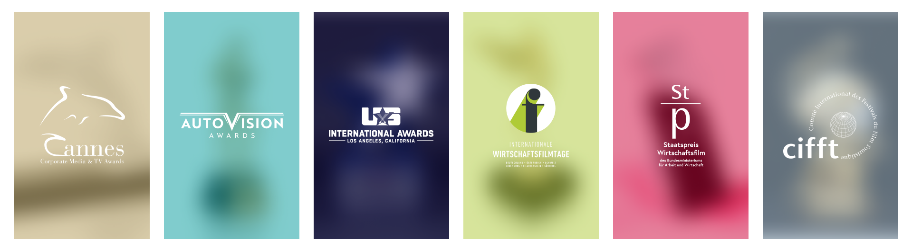
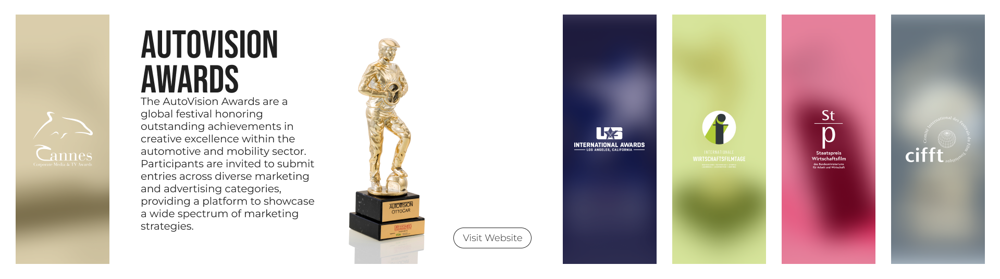

---
# Comandos para Renderizar
## Default - Não é bem o default, mas é o que considero melhor
### pandoc test.md -o example.pdf --from markdown --template eisvogel --listings -V lang=pt --bibliography=fixe.bib --citeproc

# pandoc .\index.md -o index.pdf --from markdown --template eisvogel --listings --number-sections -V lang=pt --bibliography=fixe.bib --citeproc --filter mermaid-filter.cmd

## Number Sections - Coloca uns números em capa heading
### pandoc test.md -o example.pdf --from markdown --template eisvogel --number-sections

## Ver a documentação para outros estilos

title: "Estágio"
subtitle: Tecnologias de Comunicação Multimédia - Relatório de Estágio Multimédia
author: Vitor Marques - A041449
date: "2024-05-21"
bibliography: fixe.bib
csl: fixe.csl # Faz sim uma diferença de usar este código, mas o do porto e o default é praticamente igual. depois ver se a renata quer saber

# Capa
### Ativar Capa
titlepage: true
## Cores
### Cor de Fundo da Capa
# titlepage-color: "202020"
### Cor do Texto da Capa
# titlepage-text-color: "ff0000"
### Cor do Risco da Capa
titlepage-rule-color: "00ff00"
## Risco
### Tamanho do Risco da Capa - em pontos
titlepage-rule-height: 10
## Logotipo - Não funciona SVGs
titlepage-logo: logo.png
### Tamanho do Logotipo - default 35mm
logo-width: 75mm
## Imagem de Background
# titlepage-background: 720139.jpg

# Resto das Páginas
## Imagem de Fundo das Páginas Normais
# page-background: 720139.jpg
### Opacidade da Imagem de Fundo - Default é 0.2
# page-background-opacity: 0.5
## caption-justification - Não sei o que faz... mas o default é raggedright

# TOC
### Tem ou não Indice? - Default é Falso
toc: true
### Começar uma nova página, depois do indice
toc-own-page: true
### Tem ou não Tem Indice de Figuras
lof: true
### Tem ou não tem Indice de Tabelas
lot: false
### Como deve ficar as tabelas, para aparecerem
# | Fixe | Fixe | 
# | --- | --- | 
# | 1 | 2 |
# | 3 | 4 |

# : Tabela Exemplo

# Não sei como funciona... https://pandoc.org/MANUAL.html#front-matter
thanks: true

# Código
## Desligar os números que aparecem das linhas do código - default é false
listings-disable-line-numbers: false
## Impedir uma quebra de linha dentro dos códigos - default é false - NÃO TENHO A CERTEZA
listings-no-page-break: false
## Tamanho das letras dentro do código - default \small
code-block-font-size: \small
### Tamanhos Possíveis
#### \tiny
#### \scriptsize
#### \footnotesize
#### \small
#### \normalsize
#### \large
#### \Large
#### \LARGE
#### \huge
#### \Huge

# Header e Footer
## Desligar Header e Footer - Default false
disable-header-and-footer: false

## Header
#### Contéudo do Header
header-left: Relatório de Estágio # Default para o título
# header-center: FIXE epico GAMER # texto no centro do header
header-right: " " # Default para a data

## Footer
#### Contéudo do Footer
footer-left: Vitor Tiago Magalhães Marques  #Default para o Autor
# footer-center: alguma coisa no centro # texto no centro do footer
# footer-right # Default é o page number

# Footnones
## Deixar as footnotes mais bonitas - Default False
footnotes-pretty: false # Em suma, deixa um espaço maior entre cada footnote
## Desligar o link das footnotes para o fim da página - Default false
footnotes-disable-backlinks: false # Alterei ambos e não vi diferença...

# Book
## Exportar como livro - Default false
book: false # Acho que muda o tamanho da folha impressa

# Imagens
## Posição das Imagens - Default h
# float-placement-figure: h # Por algum motivo, buga a imagem de fundo
### Valores que pode ser
#### t - topo da página
#### b - fundo da página
#### p - coloca na próxima página, onde apenas existe figuras e tabelas
#### h - coloca mais ao menos onde está no texto/markdown
#### H - coloca EXATAMENTE onde está no texto/markdown

# Tabelas
## Separar as linhas por cores - Default false
table-use-row-colors: true

#\pagenumbering{alph} % set the numbering style to lowercase letter
#style can be any of these:
#arabic: arabic numerals
#roman: lowercase roman numerals
#Roman: uppercase roman numerals
#alph: lowercase letters
#Alph: uppercase letters

block-headings: true

---

# Desenvolvimento do Projeto

## Descrição do Projeto

A Kammel Österreichisches Filmservice e.U., uma empresa centrada em festivais de curtas-metragens documentais, reconheceu a necessidade de um novo website que comunicasse eficazmente a identidade da sua marca e proporcionasse um acesso rápido à informação. O antigo website estava desatualizado, com falta de conteúdos e não estava alinhado com a imagem visual da empresa.

Os principais objetivos deste projeto consistiam em desenvolver um website simples e estático que pudesse ser facilmente atualizado no futuro. Este objetivo estava alinhado com a estratégia da empresa de aumentar a credibilidade no mercado, fornecendo uma plataforma centralizada de informação. O novo website permitiria que os clientes acedessem às informações necessárias de forma rápida e eficiente, levando a um aumento das inscrições nos festivais da empresa.

Outro fator-chave foi a equipa mais pequena da empresa e o foco na informação/conteúdo. A criação de um website simples permitiu uma utilização mais eficiente dos recursos e sublinhou a importância do conteúdo na condução dos objetivos comerciais.

O objetivo deste projeto era duplo: construir um website visualmente apelativo que transmitisse eficazmente a identidade da marca Kammel Österreichisches Filmservice e.U. e garantir que o website respondia a vários dados demográficos e preferências dos utilizadores.

Como entusiasta do design de meios digitais, fui atraído para este projeto devido à sua relevância no ambiente competitivo atual, em que plataformas online são essenciais para o sucesso. Também sempre quis aprender mais sobre desenvolvimento para a web e uma experiência de estágio como esta, não só iria enriquecer mais o meu conhecimento, como também, teria uma perspetiva verdadeira de como são feitas as coisas no mercado de trabalho. 

Durante o meu estágio na empresa, realizei outros projetos multimédia, incluindo a criação de conteúdos para redes sociais e campanhas, o que me ajudou a melhorar as minhas competências em marketing digital e proporcionou-me uma compreensão mais ampla do processo.

> ***TALVEZ APAGAR***
>
> Este projeto demonstra como um website bem concebido pode apoiar a estratégia global de uma empresa, fornecendo uma plataforma centralizada de informação, aumentando a credibilidade e impulsionando os objetivos comerciais. Ao aplicar os conselhos práticos e as melhores práticas deste projeto, os leitores podem aprender a criar sites eficazes que se alinham com os seus próprios objetivos organizacionais.

### Contexto

O atual website da empresa está desatualizado e não comunica eficazmente a sua mensagem aos utilizadores. Ao analisar o website, torna-se claro que o design não está alinhado com a identidade gráfica da empresa, tornando difícil para os visitantes reconhecerem a marca.

Um dos principais problemas do website antigo é a sua fraca abordagem mobile-first. Quando visualizado num telemóvel, muitos elementos são destruídos ou aparecem distorcidos, o que resulta numa experiência de utilizador inferior. Por exemplo, o carrossel na página inicial apresenta os logos sobre os parceiros da empresa, mas os tamanhos dos dois últimos itens são maiores do que os três primeiros, o que dificulta a leitura e deixa tudo inconsistente.

Outro desafio é que o conteúdo do website está desatualizado e não reflete com precisão o estado atual da empresa. A informação apresentada é de 2019, o que significa que alguns aspetos mudaram desde então. Além disso, as informações estão escondidas atrás de botões, o que dificulta o acesso dos utilizadores a páginas importantes como os contactos. Esta falta de transparência cria uma má experiência para o utilizador.

Felizmente, quando comecei a trabalhar na empresa, toda a informação necessária foi fornecida num documento Word, separada em secções individuais. Ao organizar este conteúdo em páginas separadas, podemos apresentar cada informação sem restrições, evitando os longos scrolls pela página e assim, o design torna-se mais profissional e organizado.

É essencial criar mais páginas e reorganizar o conteúdo para melhor servir os utilizadores. O website deve também incluir elementos interativos para o tornar mais atraente e fácil de utilizar. Além disso, a empresa precisa de ter acesso a um editor de website que não exija conhecimentos de codificação, uma vez que ninguém na equipa tem os conhecimentos necessários ou tempo para aprender a desenvolver a Web.

Por último, o antigo website carecia de objetivos, não fornecendo aos visitantes informações essenciais como a página de contactos. Esta falta de transparência cria uma má experiência para o utilizador.

### Objetivos

- Indicar claramente os objectivos do projeto, incluindo o que se esperava do seu trabalho e de que forma este beneficiaria a empresa.
  - A empresa queria atualizar o website como forma de o voltarem a utilizar
  - Eles queriam que fosse fácil mudar informações do website, portanto, era necessário utilizar algum tipo de CMS no contéudo
  - A empresa já tinha experiência com o WordPress, portanto, eles acabaram por optar por uma solução que já conheciam
  - Antes de partir para o desenvolvimento do website em si, a empresa queria ter acesso a protótipos, para assim todos na empresa compreenderem o rumo que o site tomaria

### Âmbito

- Descreva o âmbito do projeto, incluindo as características, as funcionalidades e os elementos de design que pretendia fornecer.

### Cronograma

### Metodologia

## Desenvolvimento de Protótipos em Figma

### Homepage

#### Carrossel

> Talvez Acrescentar alguma espécie de comparação com a versão antiga, ao invés de como está agora

Para implementar a filosofia principal que defini para a homepage, decidi desenvolver um elemento interativo utilizando o efeito hover. Esta escolha traz vários benefícios, tanto em termos de apresentação de informações quanto de experiência do utilizador.

O uso do hover permite apresentar uma grande quantidade de informação de forma discreta, aparecendo apenas quando o utilizador precisa. Sem essa abordagem, a página precisaria ser muito longa, semelhante a uma página da Wikipédia, o que não é adequado para a homepage de um site empresarial. Numa homepage, é essencial entregar informações de maneira rápida e bem elaborada, ao contrário da Wikipédia, que tem o propósito de apresentar uma vasta quantidade de informações. Até a própria Wikipédia utiliza uma homepage mais simples, aumentando a quantidade de informação conforme capta a atenção do utilizador.

O efeito hover aumenta a interatividade do site, o que pode resultar em maior retenção dos utilizadores. Quando os visitantes interagem mais com a página, eles tendem a passar mais tempo no site e a explorar mais conteúdo. Isso é crucial para manter os utilizadores engajados e interessados. Ou seja, isto acaba por aumentar o número de clientes, já que eles ficam mais familiarizados com a marca, acabando então por querer entrar nos festivais da Filmservice.

Com o efeito hover, é possível criar um design mais complexo, como um carrossel interativo. O elemento que desenvolvi, como forma de melhor explicar, pode ser considerado uma tabela com seis colunas e uma linha, que se adapta às mudanças de tela. Por exemplo, na versão para tablets, a tabela se transforma em três colunas e duas linhas. Este design responsivo garante uma boa experiência do utilizador em diferentes dispositivos, seguindo a mentalidade de desenvolver em mobile first.

Cada um dos seis elementos da tabela tem dois estados: inativo e hover. No estado inativo, cada elemento exibe o logótipo do parceiro do festival e um degradé animado único. No estado hover, o elemento se expande, diminuindo os outros elementos inativos, e apresenta informações adicionais. Isso permite mostrar apenas a informação que o utilizador procura, mantendo a homepage compacta, moderna e única.

Uma versão desse sistema já era utilizada na versão anterior do site, mas foi melhorada e adaptada à nova identidade da marca. Fiz alguns ajustes, como aumentar o espaço para apresentar informações, adotando um formato mais vertical. Isso permite organizar a informação em botões, textos, imagens e títulos, ao contrário da versão anterior que permitia apenas um bloco de texto grande.

Outra mudança importante foi a inclusão de uma imagem de fundo com o troféu do festival na infobox que aparece com o hover. Esta imagem atrai o utilizador a inscrever-se no festival, associando o troféu a prestígio. Além disso, incluí um botão com link para o festival, facilitando a navegação para utilizadores menos experientes com tecnologia. No design anterior, era necessário clicar em qualquer parte da infobox, o que não indicava claramente essa funcionalidade. Com o botão, essa função fica evidente, melhorando a acessibilidade e a usabilidade do site.

O desenvolvimento de elementos interativos, com efeito, hover para a homepage proporciona uma maneira eficiente e elegante de apresentar informações. Esta abordagem não só melhora a experiência do utilizador, como também permite um design mais dinâmico e adaptável. Implementar essas melhorias aumenta a retenção dos utilizadores e garante que a informação seja entregue de forma eficaz e atrativa.

#### Call to Action Par Subscrição da Newsletter

##### Modal

## Solução em Wordpress

## Refinamento

## Final

